# Lab 01 – Provisioning del SQL Database in Microsoft Fabric con i Dati Zava Retail DIY

> **Prerequisiti**
> - Accesso a Microsoft Azure (per creare una Fabric Capacity, se non disponibile)
> - Accesso a [app.fabric.microsoft.com](https://app.fabric.microsoft.com) con licenza **F2** o superiore (o trial attivo)
> - [.NET SDK 8 o superiore](https://dotnet.microsoft.com/download) installato sul proprio PC
> - [SQL Server Management Studio (SSMS)](https://aka.ms/ssmsfullsetup) installato (per la verifica finale)
> - Connessione Internet per scaricare il file BACPAC da GitHub
>
> **Durata stimata:** 30–45 minuti
>
> **Risultato atteso:** un SQL Database in Fabric contenente tutte le tabelle Zava Retail DIY, con un SQL Analytics Endpoint già disponibile e interrogabile come sorgente dati per un Fabric Data Agent.

---

## Contesto

**Zava DIY** è un dataset sintetico che simula le operazioni di una catena di negozi di bricolage (home improvement retail). Il dataset è stato reso pubblico da Microsoft come parte del repository del Microsoft AI Tour.

Useremo questo dataset per costruire un **SQL Database in Fabric** con il suo **SQL Analytics Endpoint** associato, che sarà la base per il Fabric Data Agent nei lab successivi.

### Perché SQL Database in Fabric?

I SQL Database in Fabric hanno una caratteristica chiave per questo scenario:
- appartengono al workload **Database** e sono accessibili dagli altri item Fabric
- sincronizzano automaticamente il contenuto su **OneLake** in formato Parquet
- espongono automaticamente un **SQL Analytics Endpoint** pronto per query analitiche, esattamente come Warehouse e Lakehouse

### Il file BACPAC

Il dataset originale è distribuito come backup SQL Server (`.bak`). Poiché i SQL Database in Fabric — come Azure SQL Database — non supportano il restore diretto di file `.bak`, il file è già stato convertito in formato `.bacpac` (il formato cloud equivalente) ed è disponibile nel repository pubblico:

```
https://github.com/lucazav/zava-dyi-data-repository
```

File: `zava_retail.bacpac`

> 💡 **Per chi vuole sapere come nasce il BACPAC:** la procedura originale prevedeva di ripristinare il `.bak` su un SQL Server locale (o VM) tramite SSMS, e poi esportare il database risultante come `.bacpac` tramite SSMS → tasto destro sul database → *Extract Data-tier Application*. Il file risultante è quello già presente nel repo.

Per eseguire questa conversione è stata creata una VM Windows temporanea su Azure — in modo da avere un ambiente pulito e isolato dove installare SQL Server.

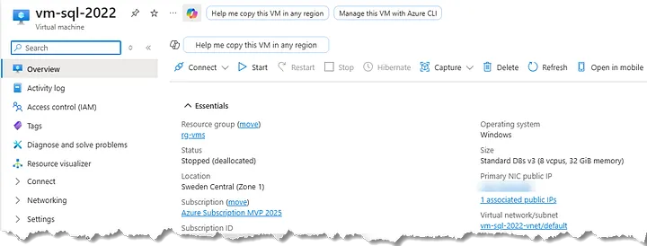
*Figura 1 — Create a new Windows VM*

Una volta connessi alla VM via RDP, sono stati installati **SQL Server 2022 Developer Edition** e **SSMS**. Tramite SSMS è stato poi eseguito il restore del file `Zava DIY.bak` sul server locale.

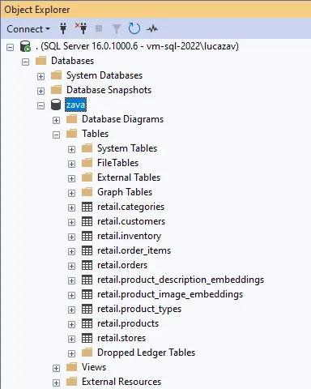
*Figura 2 — The restored zava database*

Con il database operativo, si è proceduto all'export: tasto destro sul database in SSMS → **Tasks** → **Extract Data-tier Application…** → salva come `zava_retail.bacpac`. Il file è stato poi caricato nel repository pubblico.

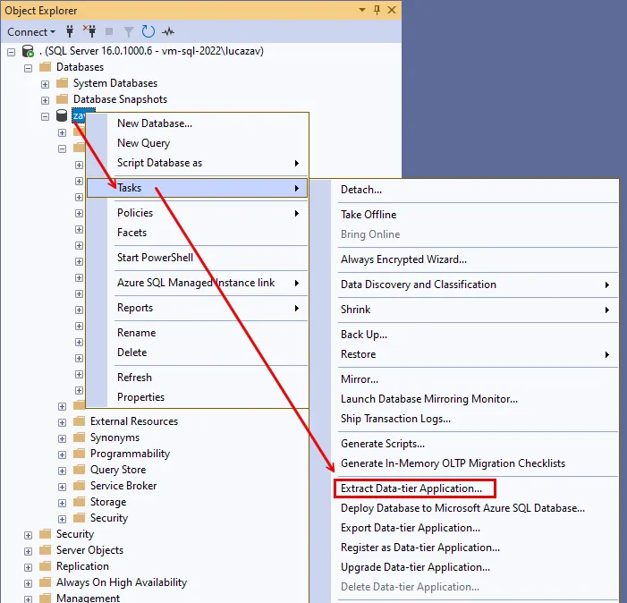
*Figura 3 — Extract a bacpac file from the zava database*

---

## Step 1 – Download del File BACPAC

1. Vai su [https://github.com/lucazav/zava-dyi-data-repository](https://github.com/lucazav/zava-dyi-data-repository)
2. Clicca sul file `zava_retail.bacpac`
3. Clicca su **Download raw file** (icona di download in alto a destra nella pagina del file)
4. Salva il file in una cartella locale, ad esempio `C:\Downloads\zava_retail.bacpac`

In alternativa, clona il repository:
```bash
git clone https://github.com/lucazav/zava-dyi-data-repository.git
```

> ✅ **Check:** il file `zava_retail.bacpac` è presente sul tuo disco locale.

---

## Step 2 – Verifica della Fabric Capacity

Per usare i SQL Database in Fabric è necessaria una **Fabric Capacity**. Se non hai una Fabric Trial attiva e/o non ti è possibile attivarla, occorre verificare di avere accesso ad una **Fabric Capacity** esistente o crearne una nuova:

1. Accedi al [portale Azure](https://portal.azure.com)
2. Cerca **Microsoft Fabric** nella barra di ricerca
3. Verifica di avere una capacity disponibile o, in alternativa, creane una nuova:
   - Vai su **+ Create a resource** → cerca **Fabric capacity**
   - Seleziona una **subscription** e un **Resource Group**
   - Scegli una **region** (preferibilmente vicina agli utenti finali)
   - Seleziona lo SKU: per i lab è sufficiente **F2** (~€262/mese, ma ricorda di stopparla al termine!)
   - Clicca su **Review + Create** → **Create**

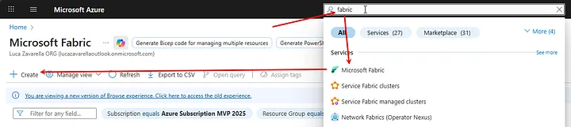
*Figura 4 — Create a Fabric capacity in the Azure portal*

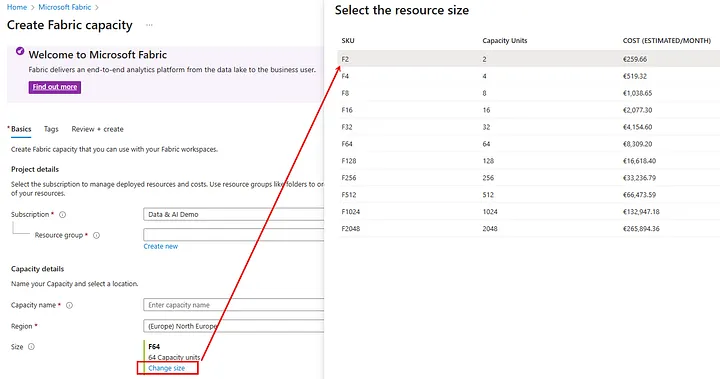
*Figura 5 — Change the Capacity size*

> ⚠️ **Attenzione ai costi:** un F64 costa ~€8.300/mese. Per i lab usa sempre F2 o F4 e ricordati di **stoppare la capacity** al termine della giornata.

> ✅ **Check:** la capacity è nello stato **Active** nel portale Azure.

---

## Step 3 – Creazione del Workspace Fabric

1. Vai su [app.fabric.microsoft.com](https://app.fabric.microsoft.com) e accedi con il tuo account.
2. Nel pannello di navigazione a sinistra, clicca su **Workspaces** → **+ New workspace**.
3. Inserisci un nome, ad esempio: `ZavaRetail`
4. Espandi la sezione **Advanced** → **License mode**:
   - Seleziona **Fabric capacity**
   - Nel dropdown **Capacity**, seleziona la capacity creata nello Step 2
5. Clicca su **Apply**.

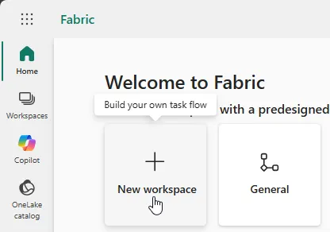
*Figura 6 — Create a new Fabric Workspace*

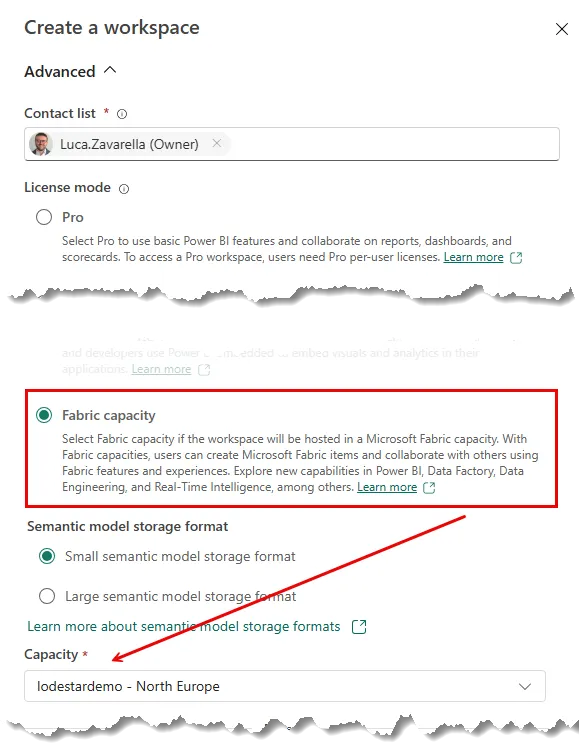
*Figura 7 — Associate your Workspace to your Fabric Capacity*

> ✅ **Check:** il workspace `ZavaRetail` compare nella lista. Sei automaticamente reindirizzato al suo interno.

---

## Step 4 – Creazione del SQL Database in Fabric

1. All'interno del workspace, clicca su **+ New item**.
2. Nella sezione **Store data**, seleziona **SQL database**.

   > ⚠️ **Attenzione:** seleziona **SQL database**, non *Mirrored SQL Server*.

3. Nella finestra di configurazione imposta:
   - **Name:** `ZavaRetail`
4. Clicca su **Create**.

5. Attendi che Fabric completi il provisioning. L'interfaccia dell'editor SQL del database si aprirà automaticamente.

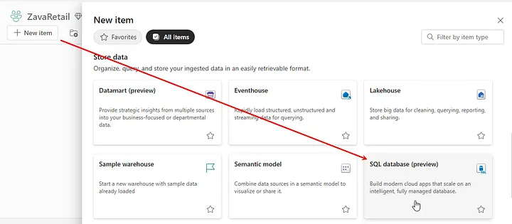
*Figura 8 — Create a new SQL database in Fabric*

> ✅ **Check:** l'editor SQL del database `ZavaRetail` è aperto. Nel workspace compaiono due item: il **SQL database** e un **SQL analytics endpoint** con lo stesso nome.

---

## Step 5 – Recupero della Connection String

Per eseguire l'import del BACPAC, è necessario conoscere il **Data Source** e l'**Initial Catalog** del database.

1. Nell'interfaccia del database `ZavaRetail`, clicca sull'**icona a forma di ingranaggio** (⚙️) in alto a destra.
2. Seleziona **Connection strings**.
3. Annota i seguenti valori:
   - **Data Source**: il prefisso alfanumerico prima di `.database.fabric.microsoft.com` è sufficiente (es. `abc123xyz`)
   - **Initial Catalog**: il nome completo del database incluso il suffisso alfanumerico (es. `ZavaRetail-abcd-1234-...`)

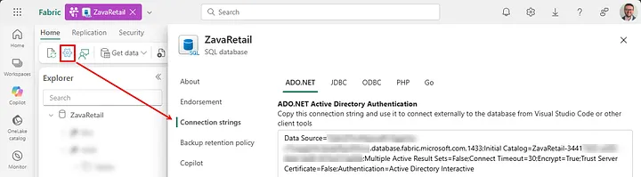
*Figura 9 — Get your connection string details*

> ✅ **Check:** hai annotato entrambi i valori. Ti serviranno nel prossimo step.

---

## Step 6 – Installazione di SqlPackage

Per importare il BACPAC nel SQL Database, si usa lo strumento **SqlPackage**, parte del framework DacFx di Microsoft.

### 6a – Verifica della presenza di .NET SDK

Prima di installare SqlPackage, verifica che il .NET SDK (versione 8 o superiore) sia già installato. In un terminale Powershell, esegui il seguente comando:

```powershell
dotnet --version
```

- Se il comando restituisce un numero di versione ≥ `8.x.x`, procedi al passo 6b.
- Se il comando non viene riconosciuto o restituisce una versione inferiore a `8.x.x`, scarica e installa il .NET SDK dal sito ufficiale: [https://dotnet.microsoft.com/download](https://dotnet.microsoft.com/download)

> ✅ **Check:** `dotnet --version` restituisce `8.x.x` o superiore.

### 6b – Verifica della presenza di SqlPackage

Verifica se SqlPackage è già installato come tool globale .NET:

```powershell
sqlpackage /version
```

- Se il comando restituisce un numero di versione, SqlPackage è già disponibile → **salta al passo 6c**.
- Se il comando non viene riconosciuto, installalo con:

```powershell
dotnet tool install -g microsoft.sqlpackage
```

Al termine, verifica nuovamente:

```powershell
sqlpackage /version
```

> ✅ **Check:** viene visualizzato il numero di versione di SqlPackage (es. `170.x.x.x`).

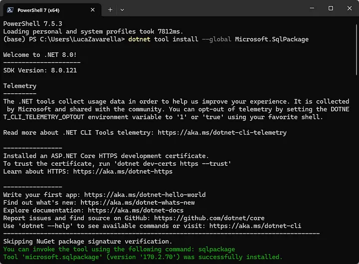
*Figura 10 — Install SqlPackage as .NET tool*

### 6c – Risoluzione del PATH (se necessario)

Se `sqlpackage` non viene riconosciuto anche dopo l'installazione, il problema è che la cartella dei .NET global tools non è nel PATH. Aggiungila manualmente per la sessione corrente:

```powershell
$env:PATH += ";$env:USERPROFILE\.dotnet\tools"
```

Poi riapri il terminale Powershell oppure esegui il comando precedente e verifica di nuovo con `sqlpackage /version`.

---

## Step 7 – Import del BACPAC nel SQL Database

Esegui il seguente comando nel terminale Powershell, sostituendo i valori raccolti nello Step 5:

```powershell
sqlpackage /action:import `
  /sourcefile:"C:\Downloads\zava_retail.bacpac" `
  /targetconnectionstring:"Data Source=tcp:<your-prefix>.database.fabric.microsoft.com,1433;Initial Catalog=<your-db-name>;Encrypt=True;Authentication=Active Directory Interactive"
```

**Esempio con valori reali:**
```powershell
sqlpackage /action:import `
  /sourcefile:"C:\Downloads\zava_retail.bacpac" `
  /targetconnectionstring:"Data Source=tcp:abc123xyz.database.fabric.microsoft.com,1433;Initial Catalog=ZavaRetail-abcd-1234-efgh-5678;Encrypt=True;Authentication=Active Directory Interactive"
```

> 💡 **Note:**
> - Verrà aperta una finestra di autenticazione Azure AD (MFA). Accedi con il tuo account Fabric.
> - L'import richiede alcuni minuti in base alla dimensione del database. Attendi il completamento senza interrompere.
> - Il parametro `Authentication=Active Directory Interactive` garantisce l'autenticazione sicura via browser/MFA.

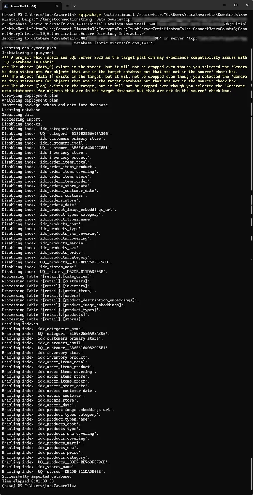
*Figura 11 — Importing bacpac data into the SQL database in Fabric*

> ✅ **Check:** il comando termina senza errori e mostra `Successfully imported database`. Torna al database `ZavaRetail` in Fabric, esegui un **Refresh** e verifica che le tabelle siano comparse nel pannello Explorer a sinistra.

---

## Step 8 – Verifica delle Tabelle nel Database

Nell'editor SQL del database `ZavaRetail` in Fabric, esegui:

```sql
SELECT TABLE_SCHEMA, TABLE_NAME
FROM INFORMATION_SCHEMA.TABLES
WHERE TABLE_TYPE = 'BASE TABLE'
ORDER BY TABLE_SCHEMA, TABLE_NAME;
```

Dovresti vedere le tabelle del dataset Zava DIY (schema `retail`), incluse:

| Schema | Tabella |
|---|---|
| retail | customers |
| retail | products |
| retail | stores |
| retail | sales |
| ... | ... |

Esegui anche un conteggio di verifica:

```sql
SELECT COUNT(*) AS totale_clienti FROM retail.customers;
```

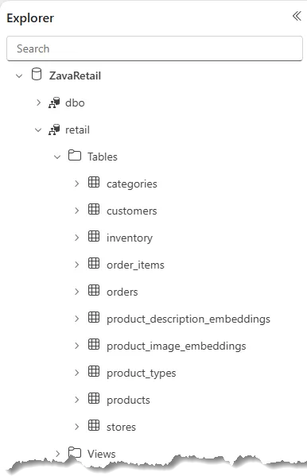
*Figura 12 — Zava DYI data tables in your ZavaRetail database in Fabric*

> ✅ **Check:** le tabelle sono presenti e i conteggi restituiscono valori > 0.

---

## Step 9 – Verifica del SQL Analytics Endpoint

L'SQL Analytics Endpoint viene creato automaticamente da Fabric insieme al SQL Database. È il punto di accesso **read-only** ottimizzato per query analitiche su OneLake.

### 9a – Verifica della presenza di SSMS

Controlla se SQL Server Management Studio (SSMS) è già installato sul tuo PC:

- Su Windows, cerca **"SQL Server Management Studio"** nel menu Start.
- In alternativa, apri un PowerShell e verifica:

```powershell
Get-Command ssms -ErrorAction SilentlyContinue
```

Se SSMS non è presente, scaricalo e installalo gratuitamente dal link ufficiale:

👉 [https://aka.ms/ssmsfullsetup](https://aka.ms/ssmsfullsetup)

Scarica la versione più recente, esegui il setup e segui l'installazione guidata (nessuna configurazione particolare richiesta).

> ✅ **Check:** SSMS si apre correttamente sul tuo PC.

### 9b – Connessione all'Endpoint da SSMS

1. Torna al workspace `ZavaRetail` in Fabric.
2. Individua l'item di tipo **SQL analytics endpoint** (stesso nome `ZavaRetail`).

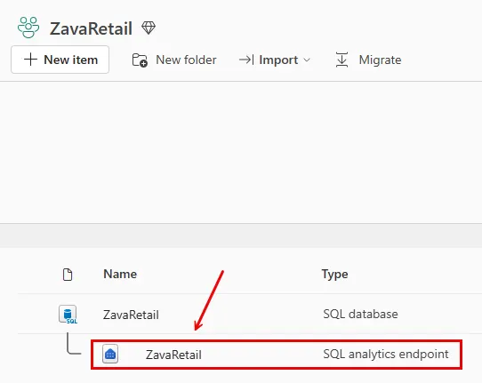
*Figura 13 — SQL Analytics Endpoint for ZavaRetail has been automatically created along with the SQL Database*

3. Clicca sui **tre puntini (…)** accanto all'endpoint e seleziona **Open in SSMS**.

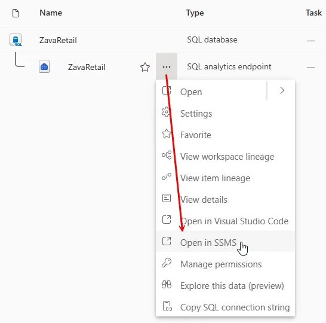
*Figura 14 — Connect to the SQL analytics endpoint with SSMS*

4. Nella finestra che si apre in Fabric, annota il **Server Name** e il **Database Name**.

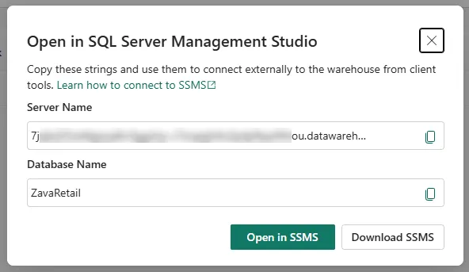
*Figura 15 — Endpoint's connection string information*

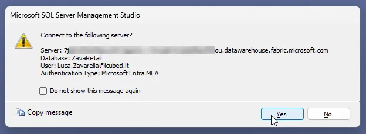
*Figura 16 — Validating the Endpoint's link within SSMS*

5. Apri SSMS sul tuo PC locale e connettiti usando quei valori:
   - **Authentication:** Azure Active Directory – MFA
   - Inserisci il tuo account e completa l'autenticazione MFA

### 9c – Query di Test sull'Endpoint

Una volta connesso, esegui una query di test:

```sql
SELECT TOP 10 *
FROM retail.customers;
```

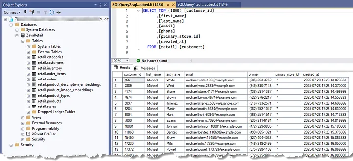
*Figura 17 — Querying the SQL analytics endpoint*

> ✅ **Check:** la query restituisce dati. L'endpoint è in sola lettura — qualsiasi `INSERT`/`UPDATE`/`DELETE` darà errore (comportamento atteso).

---

## Done Criteria

Prima di passare al Lab 02, verifica di aver completato tutti i seguenti punti:

- [ ] File `zava_retail.bacpac` scaricato in locale
- [ ] Fabric Capacity attiva e workspace `ZavaRetail` creato
- [ ] SQL Database `ZavaRetail` creato in Fabric
- [ ] Connection string (Data Source + Initial Catalog) annotata
- [ ] SqlPackage installato e funzionante
- [ ] BACPAC importato con successo nel database
- [ ] Tabelle visibili nell'editor SQL di Fabric
- [ ] SQL Analytics Endpoint verificato tramite SSMS

---

## Troubleshooting Errori Comuni

| Problema | Causa probabile | Soluzione |
|---|---|---|
| `sqlpackage` non riconosciuto | Tool non nel PATH | Riapri il terminale o aggiungi `$USERPROFILE\.dotnet\tools` al PATH |
| Errore di autenticazione durante l'import | Account non autorizzato sulla capacity | Verifica di avere il ruolo **Contributor** o **Admin** sul workspace |
| Import si blocca o fallisce a metà | Timeout di rete o capacità F2 sovraccarica | Riprova in un momento con meno carico; considera di usare F4 |
| Tabelle non visibili dopo l'import | Pagina non aggiornata | Clicca **Refresh** nel pannello Explorer dell'editor SQL |
| SSMS non si connette all'endpoint | Certificato o firewall | Verifica che `Encrypt=True` sia impostato e che non ci sia un proxy aziendale che blocchi la porta 1433 |
| Errore `BACPAC file is invalid` | File corrotto durante il download | Riscaricare il file BACPAC dal repository GitHub |

---

## Nota Finale — Stop della Fabric Capacity

Al termine del workshop, ricordati di **stoppare la Fabric Capacity** per evitare costi non necessari:

1. Vai nel [portale Azure](https://portal.azure.com)
2. Cerca la tua Fabric Capacity
3. Clicca su **Pause** (non Delete, a meno che tu non voglia rimuoverla definitivamente)

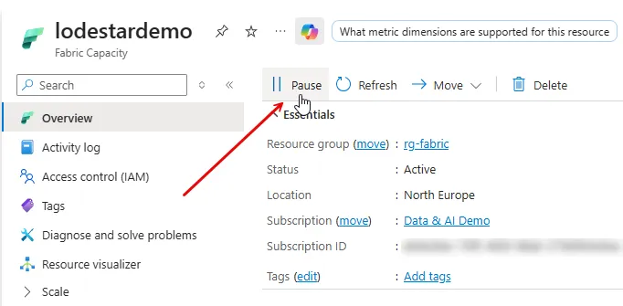
*Figura 18 — Halting your Fabric Capacity*

---

## Prossimo Step

➡️ **Lab 02 – Configurazione del Fabric Data Agent su ZavaRetail**

Nel prossimo laboratorio utilizzeremo il SQL Analytics Endpoint appena creato come sorgente dati per configurare un Fabric Data Agent, definirne le istruzioni e testarlo con domande in linguaggio naturale.