# Lab 02 – Configurazione di un Fabric Data Agent su ZavaRetail

> **Prerequisiti**
> - Lab 01 completato: SQL Database `ZavaRetail` presente in Fabric con SQL Analytics Endpoint attivo
> - Accesso a [app.fabric.microsoft.com](https://app.fabric.microsoft.com) con licenza **F2** o superiore (o trial attivo)
> - Le impostazioni **Copilot e AI** abilitate nel tenant dal Fabric Admin Portal
> - Accesso al workspace `ZavaRetail` (o il workspace equivalente creato nel Lab 01)
>
> **Durata stimata:** 60–90 minuti
>
> **Risultato atteso:** un Fabric Data Agent operativo sul dataset ZavaRetail, configurato con istruzioni, descrizioni di data source ed example queries che ne garantiscono risposte affidabili in inglese e nelle principali lingue europee e asiatiche.

---

## Contesto

I **Fabric Data Agents** consentono di rispondere a domande in linguaggio naturale su dati strutturati. Fabric trasforma la domanda dell'utente in una query SQL (processo noto come NL2SQL), esegue la query sul data source collegato e restituisce la risposta in prosa.

Microsoft dichiara esplicitamente che i Data Agent non supportano al momento lingue diverse dall'inglese. Tuttavia, con una configurazione attenta è possibile ottenere un comportamento multilingua affidabile senza modificare il modello sottostante né costruire layer di traduzione esterni.

La strategia è semplice:

1. Mantenere l'agente e i suoi asset (descrizioni, istruzioni, example queries) in **inglese**.
2. Istruire l'agente a **tradurre in inglese** la domanda dell'utente prima di generare l'SQL.
3. Istruire l'agente a **rispondere nella lingua dell'utente** una volta ottenuto il risultato.

In questo lab costruiremo questa configurazione in modo incrementale, partendo da domande di vendita realistiche, verificando i risultati SQL a ogni passo e aggiungendo solo le istruzioni strettamente necessarie.

---

## Step 1 – Verifica delle impostazioni Copilot nel tenant

Prima di creare un Data Agent, verifica che il tenant Fabric abbia le funzionalità AI/Copilot abilitate.

1. Accedi al [Fabric Admin Portal](https://app.fabric.microsoft.com/admin-portal).
2. Vai su **Tenant settings** → cerca **Copilot**.
3. Verifica che le seguenti impostazioni siano **abilitate** sotto *Copilot and Azure OpenAI Service*:
   - *Users can use Copilot and other features powered by Azure OpenAI*
   - *Users can access a standalone, cross-item Power BI Copilot experience (preview)*
   - *Capacities can be designated as Fabric Copilot capacities*

> ⚠️ **Attenzione:** le modifiche alle impostazioni tenant possono richiedere alcune ore per propagarsi. Se dopo aver abilitato Copilot il Data Agent non compare tra gli item disponibili, attendere e riprovare.

> ✅ **Check:** le impostazioni Copilot sono attive. Puoi procedere alla creazione dell'agente.

---

## Step 2 – Creazione del Data Agent nel workspace

1. Apri il workspace che contiene il SQL Database `ZavaRetail` (creato nel Lab 01).
2. Clicca su **+ New item**.
3. Assicurati che sia selezionato **All items**.
4. Nella casella di ricerca digita `data agent`.
5. Seleziona **Data Agent (preview)**.
6. Assegna un nome, ad esempio: `zava-agent`.
7. Clicca su **Create**.

> Fabric aprirà automaticamente la pagina di configurazione del Data Agent appena creato.

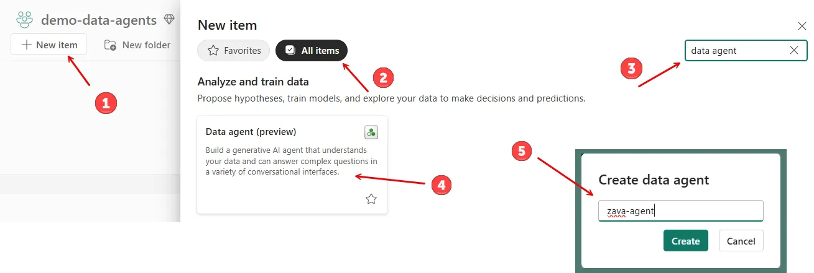
*Figura 1 — Creazione di un nuovo Data Agent item (by the author)*

> ✅ **Check:** la pagina di configurazione di `zava-agent` è aperta. Nel pannello a sinistra (Explorer) è visibile la sezione **Setup**.

---

## Step 3 – Aggiunta del data source ZavaRetail

1. Nel pannello **Explorer** a sinistra, clicca su **Add data**.
2. Nel menu a tendina seleziona **Data source** (non *Azure AI Search*, che è per scenari RAG con contenuto non strutturato).
3. Dall'elenco degli item disponibili, seleziona il **SQL database `ZavaRetail`**.
4. Clicca su **Add**.

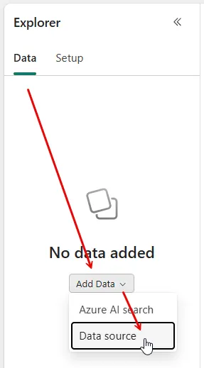
*Figura 2 — Add a data source to provide grounding data for the Data Agent (by the author)*

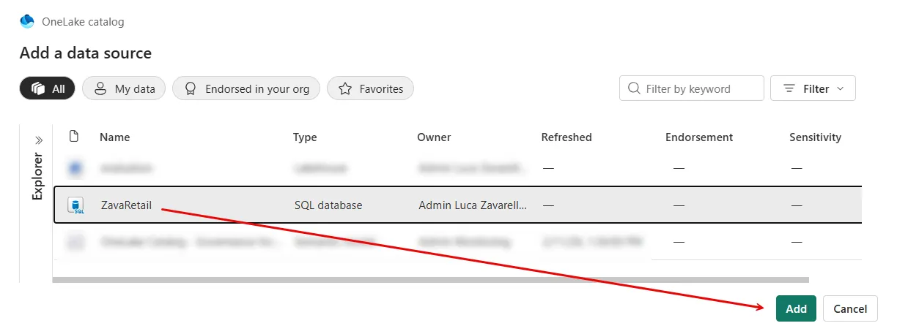
*Figura 3 — Add the ZavaRetail SQL data source (by the author)*

> ✅ **Check:** `ZavaRetail` compare nel pannello Explorer sotto **Data sources**. Sono visibili le tabelle disponibili.

---

## Step 4 – Compilazione della Data source description

La **Data source description** è il documento di onboarding che l'agente userà per capire cosa contiene il data source e a quali domande è in grado di rispondere.

1. Nel pannello Explorer clicca su **Setup**.
2. Clicca su **Data source instructions** sotto `ZavaRetail`.
3. Nel campo **Description** inserisci il seguente testo:

```
This data source contains transactional retail sales for the fictional "Zava DIY" home-improvement company, including orders and order lines across physical stores and online channels, with product details (SKU, name, product type, and category (such as Plumbing, Valves, etc.) and store/location attributes (for example "Zava Retail Seattle" and "Zava Retail Bellevue").

Use it to answer questions about revenue and profitability over time and by store or product grouping, such as: total gross and net amounts for orders in a given month, net sales, total cost, gross profit and gross margin by category or product type, and month-by-month trends for a specific product in a specific store (including running totals and profit deltas).
```

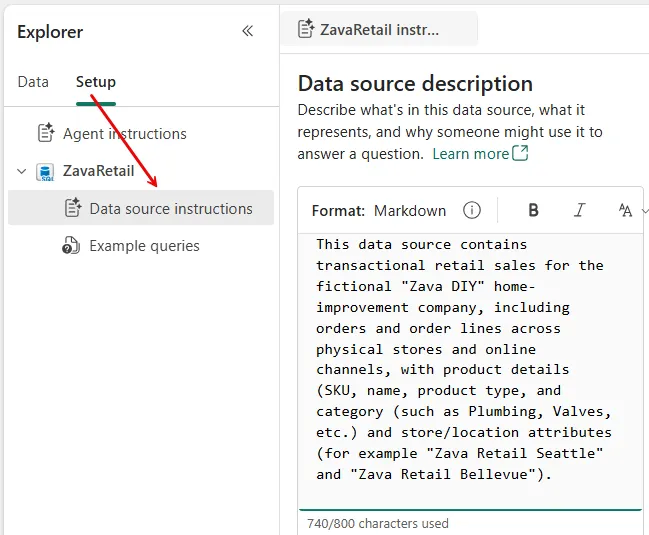
*Figura 4 — Enter the Data source description (by the author)*

> 💡 **Consiglio:** tratta la descrizione come un documento di onboarding per un analista junior. Descrivi il dominio di dati, non la struttura tecnica delle tabelle.

> ✅ **Check:** la descrizione è salvata. Puoi proseguire selezionando le tabelle.

---

## Step 5 – Selezione delle tabelle: baseline per gross e net

Per rispondere alle prime domande di vendita, l'agente ha bisogno di tre tabelle fondamentali.

Nel pannello Explorer, espandi il nodo `ZavaRetail` e seleziona (spunta) le seguenti tabelle:

- `retail.orders`
- `retail.order_items`
- `retail.stores`

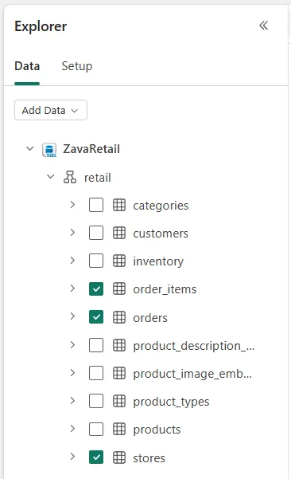
*Figura 5 — Check the tables to be used by Data Agent (by the author)*

> ✅ **Check:** le tre tabelle sono selezionate.

---

## Step 6 – Prima configurazione delle Agent instructions

Le **Agent instructions** definiscono le regole comportamentali dell'agente. Nella prima iterazione, codifichiamo le definizioni di **gross** e **net** e aggiungiamo una regola di stile per evitare granularità non richiesta.

1. Nella ribbon in alto della pagina di configurazione, clicca su **Agent instructions**.
2. Inserisci le seguenti istruzioni in formato markdown:

```markdown
## Business language

- The **Total Gross Amount** is the total value of ordered items, calculated as quantity multiplied by unit price, before any discounts are applied.
- The **Total Net Amount** is the total value of ordered items after deducting all applied discounts, representing the effective revenue amount.

## Generic instructions

- Do not provide granular details unless they are requested.
```

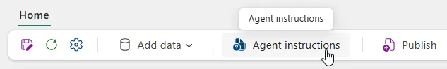
*Figura 8 — Access Agent instructions (by the author)*

> ✅ **Check:** le istruzioni sono salvate.

---

## Step 7 – Test della query gross/net (marzo 2022, Seattle)

Ora verifica che l'agente risponda correttamente alla seguente domanda:

> *Retrieve the total gross amount and total net amount for all orders placed in March 2022 at the store 'Zava Retail Seattle'*

1. Cancella l'eventuale cronologia della chat (pulsante **Clear chat** in alto a destra).
2. Inserisci la domanda nel box di chat in basso a destra e premi **Invio**.
3. Espandi la sezione dei passaggi completati per visualizzare la query SQL eseguita.

**Query di riferimento** (risultato atteso: stessi valori):

```sql
SELECT
      SUM(items.total_amount + items.discount_amount) AS gross_amount
    , SUM(items.total_amount) AS net_amount
FROM [retail].[orders] AS ord
    INNER JOIN [retail].[order_items] AS items
        ON ord.order_id = items.order_id
    INNER JOIN [retail].[stores] AS store
        ON ord.store_id = store.store_id
WHERE
    store.store_name = 'Zava Retail Seattle'
    AND ord.order_date >= '2022-03-01'
    AND ord.order_date < '2022-04-01';
```

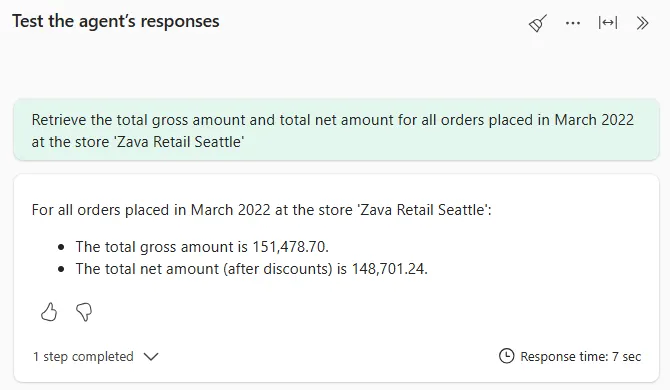
*Figura 6 — Data Agent answer on the total gross amount and total net amount question (by the author)*

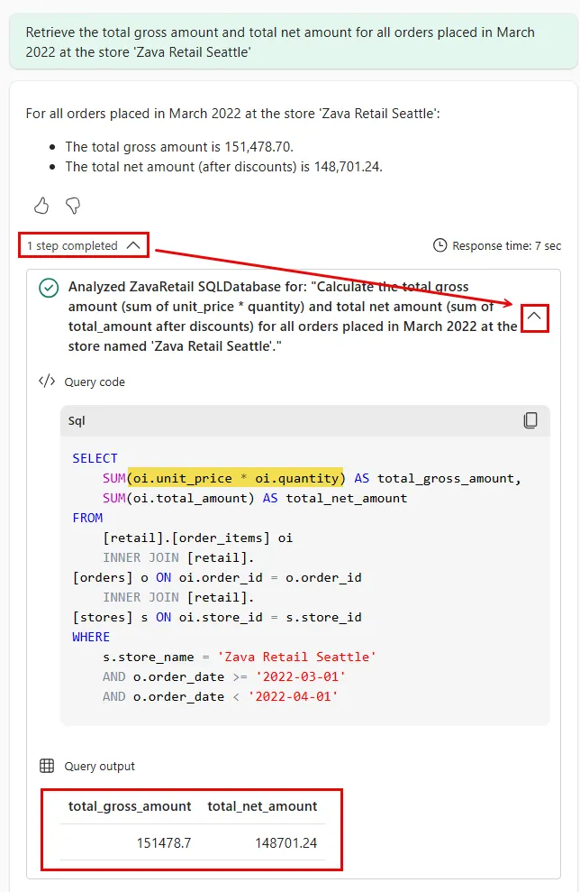
*Figura 7 — Data Agent thought about the total gross amount and total net amount question (by the author)*

> 💡 **Nota:** il Data Agent potrebbe usare un approccio leggermente diverso (es. `unit_price * quantity` invece di `total_amount + discount_amount`). Entrambi gli approcci sono matematicamente equivalenti per questo schema.

> ✅ **Check:** i valori restituiti dall'agente corrispondono ai valori della query di riferimento.

---

## Step 8 – Estensione dello schema con products e categories

Per calcolare costi e margini per categoria di prodotto, sono necessarie altre due tabelle.

Nel pannello Explorer, seleziona (spunta) anche:

- `retail.products`
- `retail.categories`

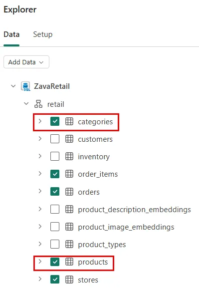
*Figura 9 — Adding "products" and "categories" tables (by the author)*

> ✅ **Check:** cinque tabelle totali sono ora selezionate.

---

## Step 9 – Prima example query: net amount, cost, profit per categoria

Le **example queries** (few-shot examples) mostrano all'agente la struttura di query che preferisci. L'agente le recupera automaticamente quando la domanda dell'utente è simile.

In questo caso vogliamo che l'agente usi `items.total_amount` come valore del net amount (il valore pre-calcolato e validato dal business), non la formula ricostruita `qty * unit_price - discount_amount`.

**Query di riferimento** per categoria `PLUMBING`, gennaio 2025:

```sql
SELECT
   SUM(items.total_amount) AS net_amount
 , SUM(prod.cost * items.quantity) AS cost
 , SUM(items.total_amount - prod.cost * items.quantity) AS profit
FROM [retail].[orders] AS ord

 INNER JOIN [retail].[order_items] AS items
     ON ord.order_id = items.order_id

 INNER JOIN [retail].[products] AS prod
     ON items.product_id = prod.product_id

 INNER JOIN [retail].[categories] AS cat
     ON prod.category_id = cat.category_id

WHERE
 cat.category_name = 'PLUMBING'

 AND ord.order_date >= '2025-01-01'
 AND ord.order_date < '2025-02-01';
```

Verifica prima l'output manuale su SSMS o sull'editor SQL del database:

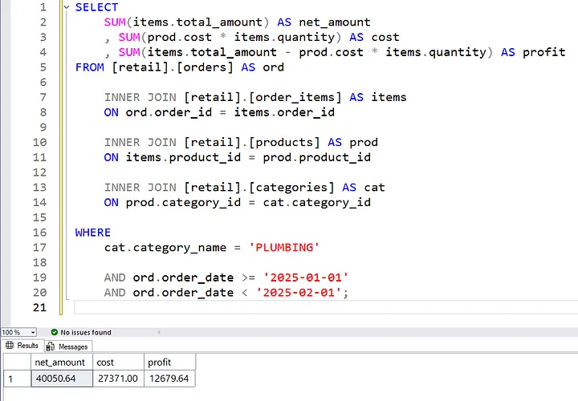
*Figura 10 — Net cost and profit for a specific category (by the author)*

Poi aggiungi l'example query al Data Agent:

1. Nel pannello Explorer clicca su **Setup**.
2. Clicca su **Example queries** sotto `ZavaRetail`.
3. Clicca su **Add example**.
4. Nel campo **Question** inserisci:
   > *I need to calculate the net amount, total cost, and profit for products belonging to category PLUMBING in January 2025*
5. Nel campo **SQL query** inserisci la query di riferimento sopra.
6. Salva.

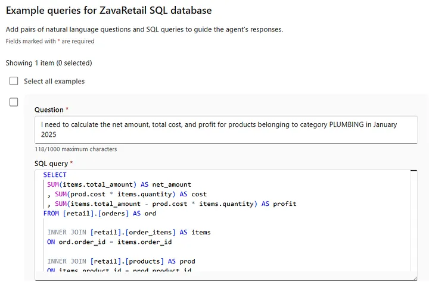
*Figura 13 — Adding an example query to show the use of total_amount (by the author)*

**Test:** cancella la chat e chiedi:
> *I need to calculate the net amount, total cost, and profit for products belonging to category POWER TOOLS in January 2025*

Verifica che la query generata usi `items.total_amount` e non la formula ricostruita.

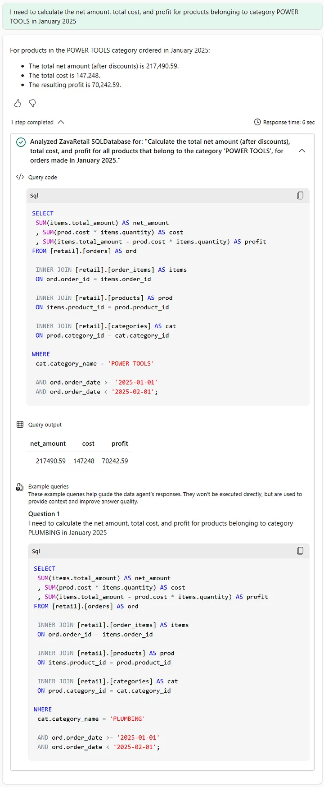
*Figura 14 — Usage of example queries as context (by the author)*

> ✅ **Check:** l'agente usa `items.total_amount` nella query SQL generata.

---

## Step 10 – Estensione schema con product_types

Per domande su tipologie di prodotto (es. VALVES, POWER TOOLS) all'interno di una categoria, aggiungere:

- `retail.product_types`

Nel pannello Explorer, seleziona (spunta) anche `retail.product_types`.

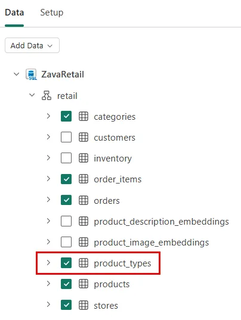
*Figura 15 — Adding the "product types" table (by the author)*

> ✅ **Check:** sei tabelle totali sono ora selezionate.

---

## Step 11 – Test della query "profit within profit" (VALVES in PLUMBING)

Cancella la chat e chiedi all'agente:

> *I need to calculate overall profit for category PLUMBING in January 2025. Within this category, compute the profit generated only by products of type VALVES, and the percentage of VALVES profit over the total.*

**Query di riferimento:**

```sql
SELECT
   SUM(items.total_amount - prod.cost * items.quantity) AS plumbing_profit
 , SUM(
     CASE
       WHEN types.type_name = 'VALVES'
       THEN items.total_amount - prod.cost * items.quantity
       ELSE 0
     END) AS valves_profit
 , SUM(
     CASE
       WHEN types.type_name = 'VALVES'
       THEN items.total_amount - prod.cost * items.quantity
       ELSE 0
     END) / SUM(items.total_amount - prod.cost * items.quantity) AS perc_valves_profit
FROM [retail].[orders] AS ord

 INNER JOIN [retail].[order_items] AS items
     ON ord.order_id = items.order_id

 INNER JOIN [retail].[products] AS prod
     ON items.product_id = prod.product_id

 INNER JOIN [retail].[categories] AS cat
     ON prod.category_id = cat.category_id

 INNER JOIN [retail].[product_types] AS types
     ON prod.type_id = types.type_id

WHERE
 cat.category_name = 'PLUMBING'

 AND ord.order_date >= '2025-01-01'
 AND ord.order_date < '2025-02-01';
```

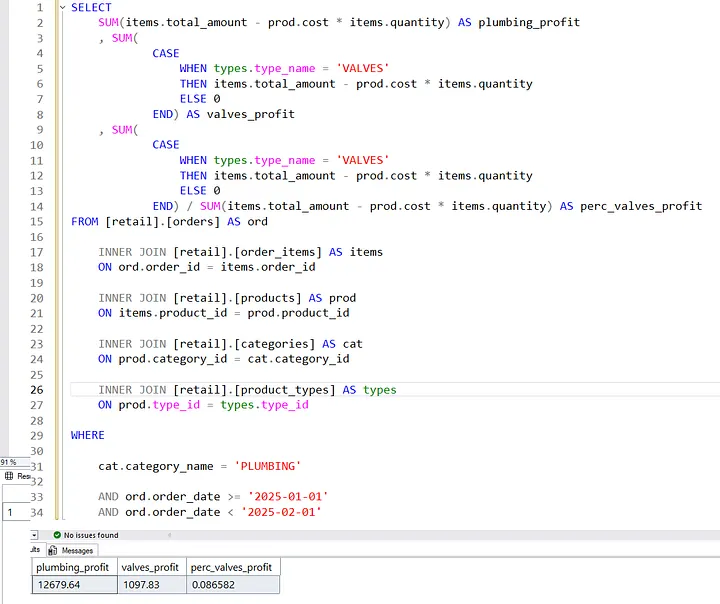
*Figura 16 — Valve product type profit within plumbing category profit (by the author)*

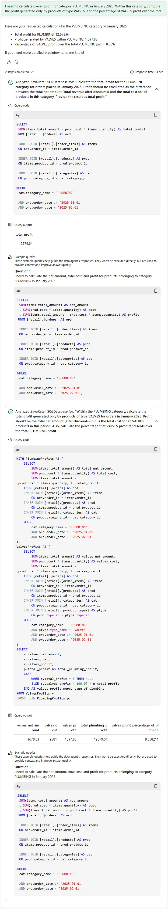
*Figura 17 — Data Agent thought about valve product type profit within plumbing category profit (by the author)*

> 💡 **Nota:** è normale che l'agente esprima il risultato come percentuale (es. `8.66%`) invece di ratio (es. `0.086582`). La percentuale è più leggibile per gli utenti finali.

> ✅ **Check:** i valori di `plumbing_profit` e `valves_profit` corrispondono alla query di riferimento.

---

## Step 12 – Gestione della convenzione di naming dei negozi

Una criticità frequente: gli utenti dicono "il negozio di Bellevue", ma nel database il nome è `Zava Retail Bellevue`. Se l'agente non conosce questa convenzione, filtra sul valore sbagliato e restituisce un risultato vuoto.

**Test prima dell'aggiornamento:** cancella la chat e chiedi:

> *Provide month-by-month detail for the 'Angle Stop Valve' product at the Bellevue store in 2024. Show running totals, gross margin and profit change. Flag the month of highest net sales.*

Se l'agente restituisce zero righe, il problema è la convenzione di naming.

Aggiungi la seguente regola alle **Agent instructions**:

```markdown
## Business language

...

- When a user says "at the [city] store" they are referring to the store with the name "Zava Retail [city]".
```

Cancella la chat e riponi la stessa domanda.

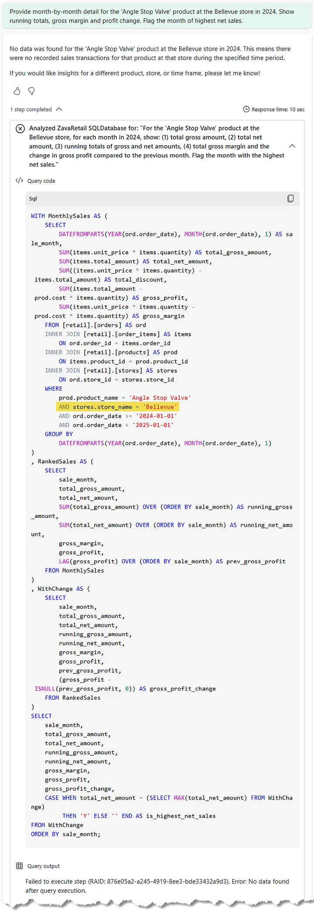
*Figura 18 — Running totals, gross margin and profit change for the wrong store (by the author)*

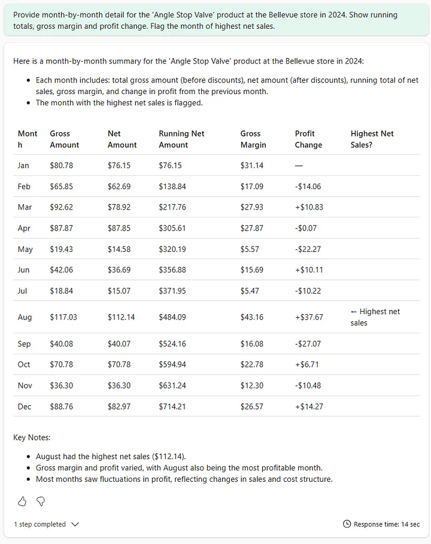
*Figura 19 — Running totals, gross margin and profit change for the right store (by the author)*

> ✅ **Check:** l'agente ora usa `'Zava Retail Bellevue'` nel filtro SQL e restituisce dati.

---

## Step 13 – Miglioramento del formato di output

Per garantire che l'agente presenti i dati in modo leggibile (tabella) piuttosto che in prosa, aggiungi un'ulteriore regola generica alle **Agent instructions**:

```markdown
## Generic instructions

...

- Always prefer to present complex data in a user-friendly table format, if possible.
```

---

## Step 14 – Gestione delle frasi fuzzy: "pipe related products"

Gli utenti di business usano spesso frasi come "prodotti relativi ai tubi" per intendere prodotti la cui descrizione contiene la parola "pipe". Aggiungi queste due regole alle **Agent instructions**:

```markdown
## Business language

...

- When a user says "[something] related products" they are referring to products whose description contains "[something]".
- When a user says "[something] product" they are referring to products whose name is "[something]".
```

**Test:** cancella la chat e chiedi:

> *I need to calculate the net amount, total cost, and profit for pipe related products in January 2025.*

**Query di riferimento:**

```sql
SELECT
   SUM(items.total_amount) AS net_amount
 , SUM(prod.cost * items.quantity) AS cost
 , SUM(items.total_amount - prod.cost * items.quantity) AS profit
FROM [retail].[orders] AS ord

 INNER JOIN [retail].[order_items] AS items
     ON ord.order_id = items.order_id

 INNER JOIN [retail].[products] AS prod
     ON items.product_id = prod.product_id

WHERE
 prod.product_description LIKE '%pipe%'

 AND ord.order_date >= '2025-01-01'
 AND ord.order_date < '2025-02-01';
```

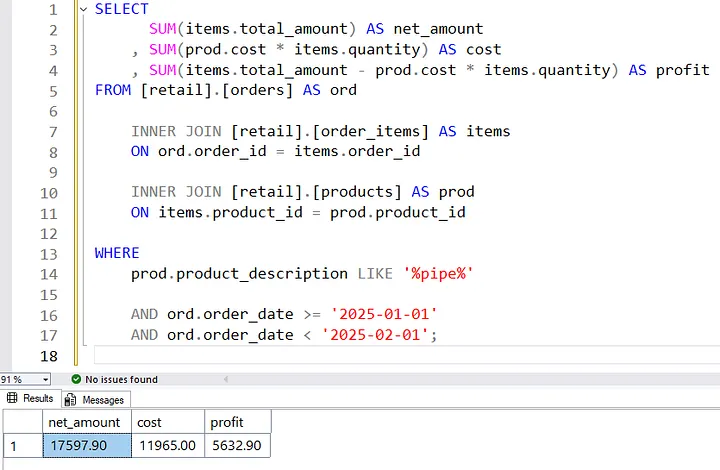
*Figura 21 — Net, cost and profit for pipe related products (by the author)*

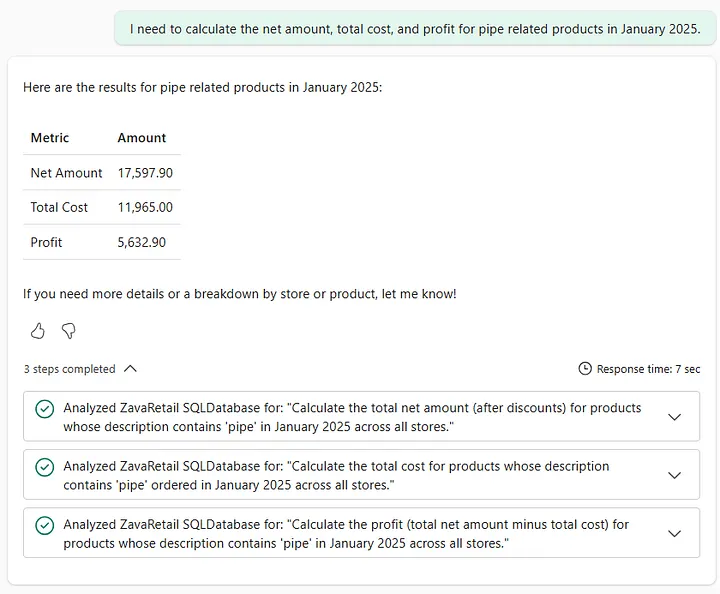
*Figura 22 — Data Agent thought for net, cost and profit for pipe related products (by the author)*

> ✅ **Check:** la query contiene `LIKE '%pipe%'` su `product_description` e i valori corrispondono alla query di riferimento.

---

## Step 15 – Abilitazione del comportamento multilingua

Adesso configuriamo l'agente per gestire domande in lingue diverse dall'inglese.

La strategia è: tradurre in inglese durante la generazione dell'SQL, rispondere nella lingua dell'utente nel testo finale.

Aggiungi le seguenti regole alle **Agent instructions**:

```markdown
## Generic instructions

...

- If the user uses a language other than English:
    - When generating the SQL query, ALWAYS translate the user question into English during the rephrasing process.
    - You MUST translate all the strings said by the user related to products, categories, types, descriptions, etc. in English.
    - ALWAYS provide the final answer to the user in the same language that they used in their question.
```

**Test in italiano:** cancella la chat e chiedi:

> *Devo calcolare l'importo netto, il costo totale e il profitto per i prodotti relativi ai lavandini nel mese di febbraio 2025.*

L'agente deve:
1. Tradurre "lavandini" → "sink" nella query SQL (`LIKE '%sink%'`).
2. Rispondere in italiano.

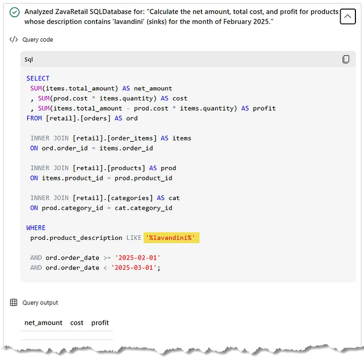
*Figura 23 — Wrong Data Agent query filtered by product descr, after translated from Italian (by the author)*

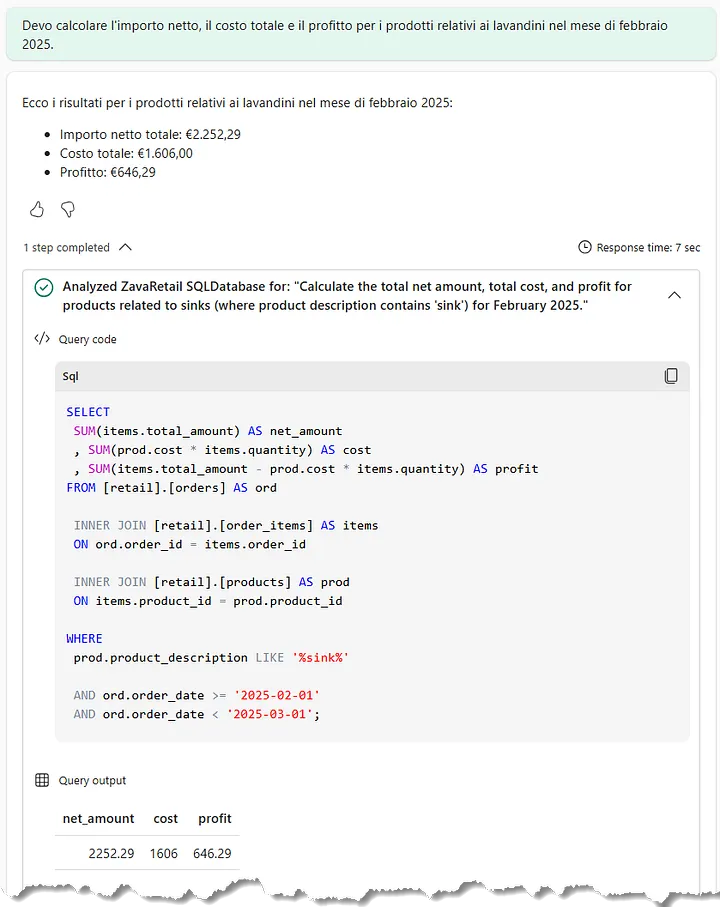
*Figura 24 — Right Data Agent query filtered by product descr, after translated from Italian (by the author)*

> ✅ **Check:** la query SQL usa `'%sink%'` (non `'%lavandini%'`) e la risposta è in italiano.

---

## Step 16 – Gestione domain columns e casing

Le colonne di dominio come `category_name` e `type_name` contengono valori in **maiuscolo** (es. `PLUMBING`), mentre `product_name` usa il **title case** (es. `Angle Stop Valve`). Se l'agente usa la traduzione libera del termine italiano senza il casing corretto, il filtro non troverà corrispondenze (specialmente su endpoint con collation case-sensitive).

Aggiungi queste istruzioni alla **Data source description** (sezione aggiuntiva sotto il testo iniziale):

```
## Columns content
- Column [category_name] of table [retail].[categories]
    - For category names consider that the allowed values are ELECTRICAL, GARDEN & OUTDOOR, HAND TOOLS, HARDWARE, LUMBER & BUILDING MATERIALS, PAINT & FINISHES, PLUMBING, POWER TOOLS, STORAGE & ORGANIZATION. So, if the users are looking for a specific category, try to understand which of the previous one they are looking for

## Formatting used
When generating the SQL query, ALWAYS format any strings that are being used in conditions for the following columns:

- The column [category_name] of table [retail].[categories] contains values in uppercase
- The column [type_name] of table [retail].[product_types] contains values in uppercase
- The column [product_name] of table [retail].[products] contains values in title case
```

**Test in italiano:** cancella la chat e chiedi:

> *Qual è il prodotto più venduto del 2025 nella categoria degli impianti idraulici?*

L'agente deve:
1. Mappare "impianti idraulici" → `'PLUMBING'` (maiuscolo, valore ammesso).
2. Eseguire una query che ordina per unità vendute o netto.
3. Rispondere in italiano.

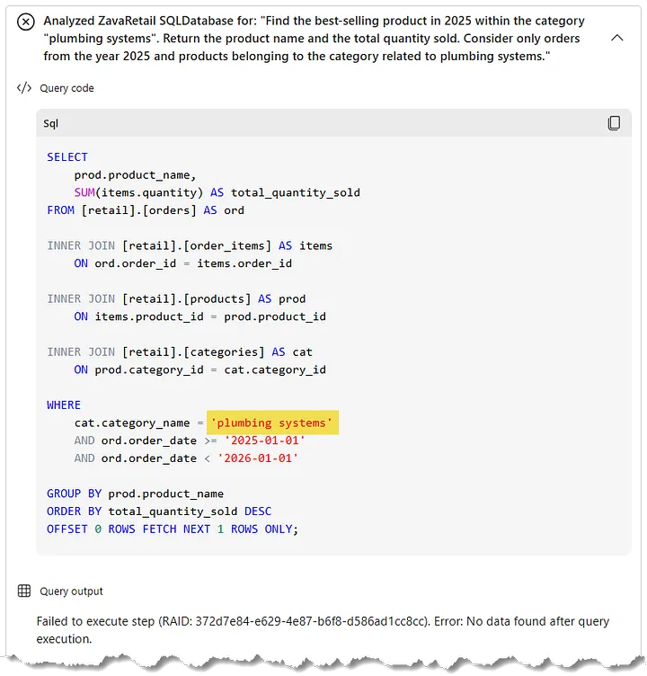
*Figura 24 — Wrong Data Agent query filtered by category name, after translated from Italian (by the author)*

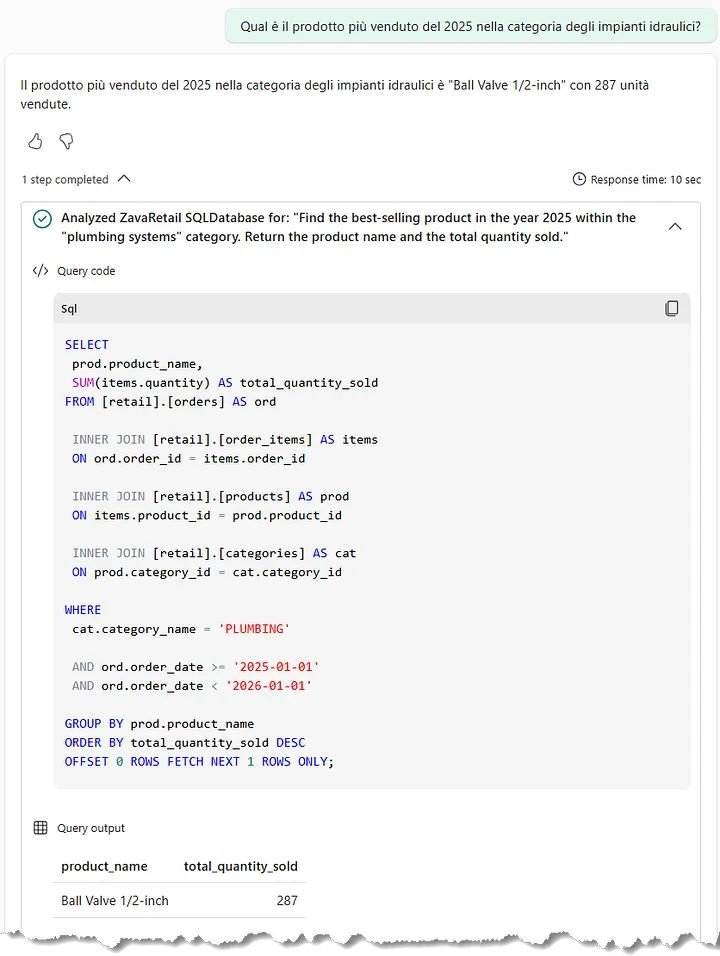
*Figura 25 — Right Data Agent query filtered by category name, after translated from Italian (by the author)*

> ✅ **Check:** la query contiene `category_name = 'PLUMBING'` (uppercase) e la risposta è in italiano.

---

## Step 17 – Test finale multilingua

Cancella la chat e fai una domanda complessa in italiano:

> *Fornisci i dettagli mese per mese per il prodotto 'Angle Stop Valve' nel negozio di Bellevue nel 2024. Mostra i totali progressivi, il margine lordo e la variazione del profitto. Evidenzia il mese con le vendite nette più alte.*

Poi, facoltativamente, testa la stessa domanda in **francese**:

> *Fournissez des détails mensuels pour le produit scrolling jigsaw dans le magasin Bellevue en 2024. Indiquez les totaux cumulés, la marge brute et l'évolution des bénéfices. Signalez le mois où les ventes nettes ont été les plus élevées.*

E in **cinese tradizionale**:

> *請提供2024年貝爾維尤店 scrolling jigsaw 產品的逐月詳細數據。顯示累計總額、毛利及利潤變動，並標註淨銷售額最高的月份。*

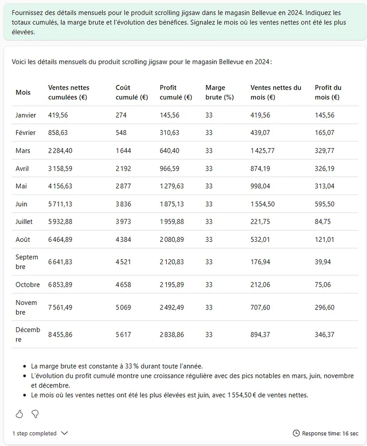
*Figura 26 — Data Agent speaking in French (by the author)*

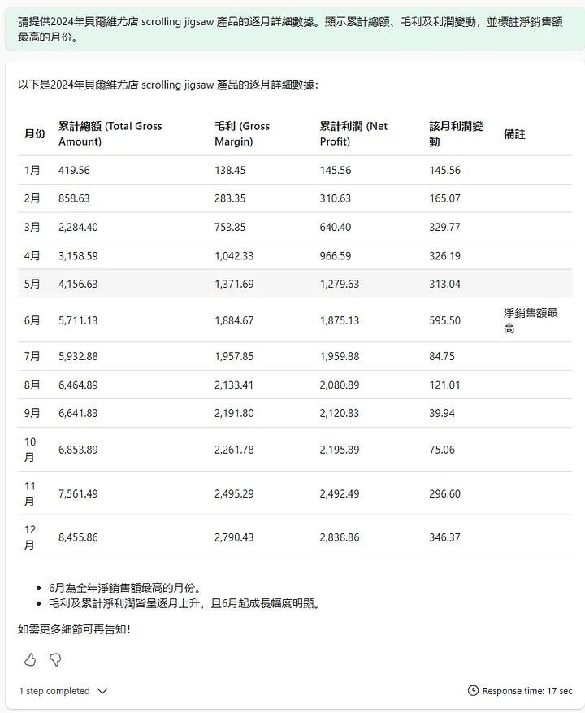
*Figura 27 — Data Agent speaking in Traditional Chinese (by the author)*

> 💡 **Constraint importante:** i nomi di prodotto, SKU e valori di dominio (categorie, tipi) devono sempre essere forniti **in inglese**, come appaiono nel database. La traduzione del nome prodotto nella lingua dell'utente è ancora inaffidabile e può causare zero risultati.

> ✅ **Check:** l'agente risponde nella stessa lingua della domanda, usando tabelle leggibili con totali progressivi, margine lordo e highlight del mese migliore.

---

## Configurazione finale consolidata

### Agent instructions complete

```markdown
## Business language

- The **Total Gross Amount** is the total value of ordered items, calculated as quantity multiplied by unit price, before any discounts are applied.
- The **Total Net Amount** is the total value of ordered items after deducting all applied discounts, representing the effective revenue amount.
- When a user says "at the [city] store" they are referring to the store with the name "Zava Retail [city]".
- When a user says "[something] related products" they are referring to products whose description contains "[something]".
- When a user says "[something] product" they are referring to products whose name is "[something]".

## Generic instructions

- Do not provide granular details unless they are requested.
- Always prefer to present complex data in a user-friendly table format, if possible.
- If the user uses a language other than English:
    - When generating the SQL query, ALWAYS translate the user question into English during the rephrasing process.
    - You MUST translate all the strings said by the user related to products, categories, types, descriptions, etc. in English.
    - ALWAYS provide the final answer to the user in the same language that they used in their question.
```

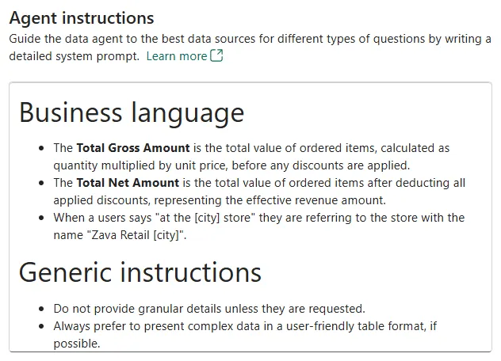
*Figura 20 — Agent instructions up to this point (by the author)*

### Data source instructions complete

```
This data source contains transactional retail sales for the fictional "Zava DIY" home-improvement company, including orders and order lines across physical stores and online channels, with product details (SKU, name, product type, and category (such as Plumbing, Valves, etc.) and store/location attributes (for example "Zava Retail Seattle" and "Zava Retail Bellevue").

Use it to answer questions about revenue and profitability over time and by store or product grouping, such as: total gross and net amounts for orders in a given month, net sales, total cost, gross profit and gross margin by category or product type, and month-by-month trends for a specific product in a specific store (including running totals and profit deltas).

## Columns content
- Column [category_name] of table [retail].[categories]
    - For category names consider that the allowed values are ELECTRICAL, GARDEN & OUTDOOR, HAND TOOLS, HARDWARE, LUMBER & BUILDING MATERIALS, PAINT & FINISHES, PLUMBING, POWER TOOLS, STORAGE & ORGANIZATION. So, if the users are looking for a specific category, try to understand which of the previous one they are looking for

## Formatting used
When generating the SQL query, ALWAYS format any strings that are being used in conditions for the following columns:

- The column [category_name] of table [retail].[categories] contains values in uppercase
- The column [type_name] of table [retail].[product_types] contains values in uppercase
- The column [product_name] of table [retail].[products] contains values in title case
```

---

## Done Criteria

Prima di passare al Lab 03, verifica di aver completato tutti i seguenti punti:

- [ ] Copilot/AI abilitati nel tenant Fabric
- [ ] Data Agent `zava-agent` creato nel workspace corretto
- [ ] Data source `ZavaRetail` aggiunto con le sei tabelle selezionate
- [ ] Data source description inserita (testo base + `Columns content` + `Formatting used`)
- [ ] Agent instructions inserite (versione completa consolidata)
- [ ] Example query per net/cost/profit con `total_amount` aggiunta
- [ ] Test gross/net marzo 2022 Seattle: valori corretti ✅
- [ ] Test net/cost/profit per categoria: valori corretti ✅
- [ ] Test "profit within profit" VALVES in PLUMBING: valori corretti ✅
- [ ] Test running totals Bellevue store (con store naming corretto): valori corretti ✅
- [ ] Test "pipe related products": query usa `LIKE '%pipe%'` ✅
- [ ] Test in italiano (lavandini → sink, category in italiano → PLUMBING uppercase): risposte in italiano ✅

---

## Troubleshooting frequente

| Problema | Causa probabile | Soluzione |
|---|---|---|
| Opzione "Data Agent" non compare tra i New items | Copilot non abilitato nel tenant | Verifica le impostazioni nel Fabric Admin Portal e attendi la propagazione |
| Risultato vuoto su domanda in italiano | Literal italiano usato nel filtro SQL (es. `LIKE '%lavandini%'`) | Verifica che la regola di traduzione sia nelle Agent instructions |
| Risultato vuoto per categoria (es. "impianti idraulici") | Traduzione libera non corrisponde al valore di dominio | Aggiungi i valori ammessi di `category_name` nelle Data source instructions |
| Filtro categoria non funziona nonostante la traduzione | Collation case-sensitive: il valore non è in uppercase | Aggiungi la regola di formatting uppercase nelle Data source instructions |
| Output in prosa anziché tabella | Agent instructions non contengono la regola sul formato tabella | Aggiungi la regola `Always prefer to present complex data in a user-friendly table format` |
| Agente usa formula ricostruita invece di `total_amount` | Example query non ancora aggiunta | Verifica che l'example query con `total_amount` sia presente nelle Example queries |
| Nome negozio non riconosciuto (zero righe) | L'utente ha scritto "Bellevue" invece di "Zava Retail Bellevue" | Verifica che la regola sul naming store sia nelle Agent instructions |
| Prodotto non trovato quando il nome è nella lingua dell'utente | Nome prodotto tradotto non corrisponde al valore nel DB | Ricorda agli utenti di usare sempre il nome del prodotto in inglese (come nel database) |

---

## Nota sul non-determinism del modello

L'agente usa un LLM (attualmente GPT-4.1) per generare SQL a partire dal linguaggio naturale. I modelli di questo tipo sono **non deterministici**: la stessa domanda posta in momenti diversi può produrre query leggermente diverse.

La configurazione descritta in questo lab riduce significativamente la variabilità, ma non la elimina. In particolare:

- **Rimani vicino ai pattern di domanda testati.** Domande con struttura molto diversa da quelle previste possono portare a risultati "tecnicamente corretti ma semanticamente sbagliati".
- **I nomi di entità (prodotto, SKU, categoria) devono essere in inglese.** La traduzione del nome prodotto è ancora inaffidabile come filtro esatto.
- **Domande ampiamente fuori scope possono ricevere risultati vuoti o imprecisi.** Comunica agli utenti i tipi di domande supportate.

---

## Prossimo Step

➡️ **Lab 03 – Benchmarking della Robustezza del Fabric Data Agent**

Nel prossimo laboratorio costruiremo un benchmark ispirato a Spider2 per misurare in modo riproducibile la qualità delle risposte dell'agente in italiano, identificare i pattern di domanda più fragili e definire una baseline di accuratezza misurabile nel tempo.