# Lab 03 – Benchmarking della Robustezza del Fabric Data Agent

> **Prerequisiti**
> - Lab 01 completato: SQL Database `ZavaRetail` presente in Fabric con SQL Analytics Endpoint attivo
> - Lab 02 completato: Data Agent `zava-agent` configurato con istruzioni, data source description ed example queries
> - Accesso al workspace `ZavaRetail` (o il workspace equivalente)
> - Microsoft Excel, Google Sheets o qualsiasi tool in grado di aprire file `.xlsx`
> - Fabric Capacity F4 o superiore raccomandata per l'esecuzione del benchmark completo (vedi nota sui consumi)
>
> **Durata stimata:** 120–180 minuti
>
> **Risultato atteso:** un'esecuzione completa del benchmark da 72 domande tramite il workflow ufficiale Fabric `evaluate_data_agent`, con summary metrics, dettaglio row-level, export diagnostico e una baseline di accuratezza calcolata e commentata.

---

## Contesto

Al termine del Lab 02, il `zava-agent` è configurato e risponde correttamente alle domande di esempio testate durante la configurazione. Ma quanto è davvero robusto? Quanto si comporta bene su domande che non sono state previste? E come possiamo misurarlo in modo riproducibile nel tempo?

I Fabric Data Agent – come qualsiasi sistema NL2SQL basato su LLM – sono **non deterministici**: la stessa domanda posta in momenti diversi può produrre query leggermente diverse. Senza un benchmark strutturato, qualsiasi valutazione resta soggettiva e non comparabile tra sessioni o versioni dell'agente.

In questo lab utilizzeremo un **benchmark ispirato a Spider2** di 72 domande in italiano per:

1. Completare il dataset di valutazione con le risposte attese (ground truth).
2. Eseguire la valutazione programmatica tramite l'SDK ufficiale Fabric.
3. Leggere summary metrics e dettaglio row-level.
4. Analizzare il comportamento del validator e il critic prompt.
5. Calcolare e commentare una baseline di accuratezza riproducibile.

Il benchmark copre volutamente pattern diversi: filtri semplici, aggregazioni, ragionamento su domini business, gestione del naming dei negozi, fuzzy matching sulle descrizioni, composizione logica, ragionamento temporale, e richieste di ranking.

---

## Parte 1 – Il Benchmark: da Spider2 al File Finale

### Perché un benchmark strutturato

Verificare le risposte dell'agente manualmente durante la configurazione non è sufficiente: dimostra che il sistema funziona sugli esempi noti, non che è robusto su domande nuove. Serve un set di domande che misuri la capacità di **generalizzare**, non quella di memorizzare.

Il benchmark è ispirato a **Spider2**, uno dei dataset di riferimento più rigorosi per sistemi NL2SQL su database reali. L'obiettivo è adattare quella filosofia al dataset ZavaRetail e al contesto italiano.

### Come è stato costruito il benchmark

Il processo segue una pipeline riproducibile:

1. **Partire dalle domande già testate** durante la configurazione dell'agente (Lab 02) e collassarle in **intent canonici** distinti.
2. **Validare ogni intent** rispetto al perimetro reale dello schema ZavaRetail e alle regole di business.
3. **Congelare le definizioni metriche** per rendere il benchmark stabile nel tempo (vedi Step 1 in Parte 2).
4. **Estendere la copertura** con nuovi intent grounded su aree analitiche non ancora testate.
5. **Generare 4 varianti linguistiche** per ogni intent: formulazione canonica + tre riformulazioni (colloquiale, executive, implicita).
6. **Assemblare la master table** ed esportare l'artifact finale.

Il risultato è:

| Dimensione | Valore |
|---|---|
| Intent totali | 18 |
| Varianti per intent | 4 |
| Domande totali | 72 |
| Layer di copertura | `ARTICLE_CORE` + `SCHEMA_EXTENDED` |
| Categorie analitiche | 5 (aggregazioni, group-by/ranking, time intelligence, filtri testuali, confronti multi-metrica) |

Per la descrizione completa della metodologia, consulta l'articolo originale:

> 📄 [Building a Spider2-Inspired Benchmark to Measure the Real Robustness of a Fabric Data Agent in Italian](https://medium.com/data-science-collective/building-a-spider2-inspired-benchmark-to-measure-the-real-robustness-of-a-fabric-data-agent-in-ita-abe6f0781b34?sk=578ebfa0faf70fc2b0c40608ed5c3443)

### Download del benchmark finale

> 📥 **[Scarica `final_benchmark.xlsx`](https://github.com/lucazav/Measure-the-Real-Robustness-of-a-Fabric-Data-Agent-in-Italian/raw/refs/heads/main/final_benchmark.xlsx)**

> ✅ **Check:** hai scaricato `final_benchmark.xlsx` e puoi aprirlo. Sono visibili le colonne `question`, `variant_type`, `intent_id`, `question_id` e le colonne di metadato del benchmark.

---

## Parte 2 – La Valutazione: dal Benchmark al Workflow Fabric

Per una descrizione dettagliata, consulta l'articolo:

> 📄 [We Built the Benchmark. Now Let's Evaluate the Fabric Data Agent for Real](https://medium.com/data-science-collective/we-built-the-benchmark-now-lets-evaluate-the-fabric-data-agent-for-real-a8ffef236693?sk=17a8bdfc719488ffcf83c04c58d427b1)

---

## Step 1 – Congelare le definizioni metriche e le regole di ranking

Prima di procedere con qualsiasi valutazione, è necessario congelare alcune definizioni che rendono il benchmark stabile e non soggetto a interpretazioni diverse tra sessioni.

### Metriche ufficiali del benchmark

| Metrica | Formula |
|---|---|
| **Total Gross Amount** | `SUM(order_items.quantity * order_items.unit_price)` |
| **Total Net Amount** | `SUM(order_items.total_amount)` |
| **Total Cost** | `SUM(products.cost * order_items.quantity)` |
| **Profit** | `SUM(order_items.total_amount - products.cost * order_items.quantity)` |
| **Gross Margin %** | `100 * profit / gross_amount` |

Queste definizioni impediscono al benchmark di spostarsi verso formule ricostruite che appaiono corrette ma non corrispondono ai valori business approvati.

### Regola aggiuntiva da aggiungere alle Agent instructions

Per evitare ambiguità sulle domande di ranking, aggiungere la seguente regola alle **Agent instructions** del `zava-agent`:

```markdown
## Business language
...
- When the user asks for the **best-selling** product, category, or product type, you MUST rank results primarily by the total quantity sold, calculated as `SUM(quantity)`.
- If two or more results have the same total quantity sold, you MUST break ties using the **Total Net Amount**, calculated as `SUM(total_amount)`, with the highest value ranked first.
- Do not interpret **best-selling** as highest revenue unless the user explicitly asks for revenue, net amount, or sales value.
```

> ✅ **Check:** le Agent instructions del `zava-agent` contengono la nuova regola su `best-selling`. Le definizioni metriche sono chiare e condivise.

---

## Step 2 – Completare la colonna `expected_answer`

Il file `final_benchmark.xlsx` contiene tutte le domande, ma la colonna `expected_answer` è ancora vuota. Questa colonna è il ponte tra un catalogo di domande e un dataset di valutazione eseguibile: senza di essa, Fabric non ha nulla con cui confrontare l'output dell'agente.

### Procedura di popolamento

Il metodo è manuale ma deliberato, poiché forza una validazione del ground truth prima di qualsiasi automazione:

1. Apri `final_benchmark.xlsx`.
2. Filtra le righe dove `variant_type = canonical` (queste sono le domande canoniche, una per intent).
3. Per ogni domanda canonica:
   a. Aprire il `zava-agent` in Fabric con chat pulita (**Clear chat**).
   b. Porre la domanda canonica all'agente.
   c. Verificare attentamente la risposta: controllare la query SQL generata e confrontare il valore con una query di riferimento eseguita direttamente sul database.
   d. Se la risposta è corretta, copiare il testo esatto nella colonna `expected_answer` della riga canonica.
   e. Propagare la stessa risposta attesa nelle **tre righe variante** con lo stesso `intent_id`.
4. Ripetere per tutti i 18 intent canonici fino a popolare l'intera colonna.

> 💡 **Perché usare la stessa risposta attesa per le varianti?** Le tre varianti linguistiche rappresentano la stessa richiesta analitica riformulata diversamente. L'obiettivo è misurare la robustezza linguistica, non cambiare il significato business. Tutte e quattro le formulazioni devono quindi essere giudicate contro lo stesso ground truth.

> ✅ **Check:** la colonna `expected_answer` è completamente popolata per tutte le 72 righe del benchmark. Salva il file come `final_benchmark_with_expected_answers.xlsx`.

### Download del benchmark con risposte attese (già compilato)

Se preferisci usare il file già compilato:

> 📥 **[Scarica `final_benchmark_with_expected_answers.xlsx`](https://github.com/lucazav/Measure-the-Real-Robustness-of-a-Fabric-Data-Agent-in-Italian/raw/refs/heads/main/final_benchmark_with_expected_answers.xlsx)**

---

## Step 3 – Nota operativa: consumi e capacity

> ⚠️ **Attenzione importante prima di procedere.**

La valutazione di un Data Agent su Fabric non è un workload trascurabile. Dall'esperienza diretta con questo benchmark:

- Su una **capacity F2**, eseguire il benchmark da 72 domande anche solo 2–3 volte, combinato con l'uso del Data Agent e l'esecuzione di notebook Python, è sufficiente a innescare l'errore **"capacity limit exceeded"**.
- Anche su una **capacity F4**, dopo poche ulteriori esecuzioni (3–4 run) si raggiunge nuovamente il limite.

Questo non è solo un dettaglio tecnico. Ha implicazioni architetturali dirette:

- Se i Data Agent devono uscire dalla fase sperimentale ed entrare in uso reale da parte di utenti di business, è spesso prudente **isolare la domanda AI dai workload di data engineering**, dimensionando una **Fabric Copilot Capacity dedicata** in base al volume atteso di interazioni e alla concorrenza.
- Quando uso conversazionale e pipeline di trasformazione dati competono per lo stesso pool di compute, l'affidabilità di entrambi può deteriorarsi rapidamente.

Per i riferimenti ufficiali Microsoft sul consumo CU del Data Agent, consulta: [Data agent consumption - Microsoft Fabric](https://learn.microsoft.com/fabric/data-science/data-agent-consumption).

> ✅ **Check:** sei consapevole delle implicazioni sui consumi. Se stai usando F2, considera di passare temporaneamente a F4 per l'esecuzione completa del benchmark.

---

## Step 4 – Creazione del Lakehouse `evaluation`

Per rendere il file Excel accessibile da un notebook Fabric, è necessario caricarlo in un Lakehouse. Il modo più semplice è creare un Lakehouse dedicato esclusivamente al workflow di valutazione.

1. Nel workspace Fabric, clicca su **+ New item**.
2. Cerca **Lakehouse** e selezionalo.
3. Assegna il nome **`evaluation`** e clicca su **Create**.

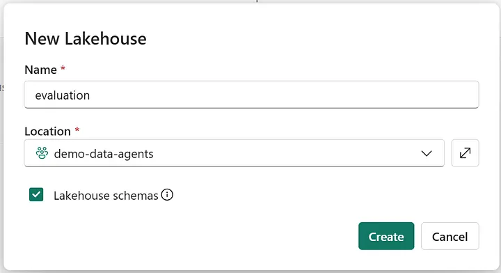
*Figura 1 — Create the "evaluation" Lakehouse (by the author)*

4. Apri il Lakehouse appena creato.
5. Vai nella sezione **Files**.
6. Carica il file `final_benchmark_with_expected_answers.xlsx`.

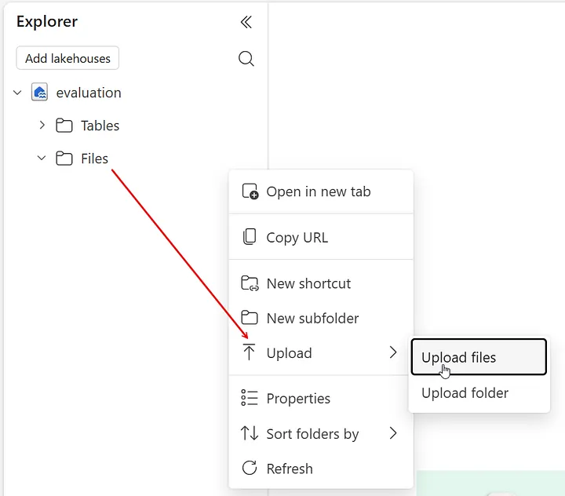
*Figura 2 — Upload the benchmark Excel file into the Lakehouse (by the author)*

7. Una volta caricato, clicca sui **tre puntini (…)** accanto al file e seleziona **Copy ABFS path**. Annota questo valore: ti servirà nel notebook.

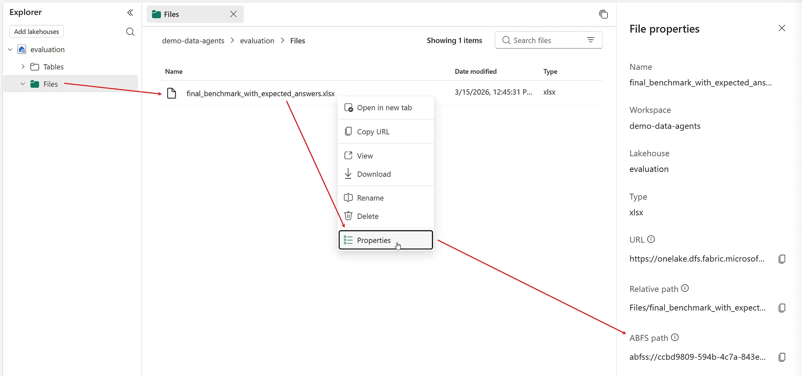
*Figura 3 — Copy the ABFS path of the benchmark Excel file (by the author)*

> ✅ **Check:** il Lakehouse `evaluation` è creato, il file Excel è caricato nella sezione Files, e hai copiato il path ABFS del file.

---

## Step 5 – Creazione del notebook `zava_agent_evaluation`

1. Nel workspace Fabric, clicca su **+ New item**.
2. Cerca **Notebook** e selezionalo.
3. Assegna il nome **`zava_agent_evaluation`** e clicca su **Create**.
4. Una volta aperto il notebook, cambia il kernel in **Python** dalla barra degli strumenti in alto.

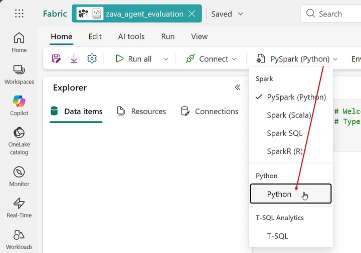
*Figura 4 — Change the kernel of the zava_agent_evaluation notebook to Python (by the author)*

> ✅ **Check:** il notebook `zava_agent_evaluation` è aperto con kernel Python.

---

## Step 6 – Installazione dell'SDK e caricamento del dataset

### Cella 1 – Installazione di `fabric-data-agent-sdk`

```python
%pip install -U fabric-data-agent-sdk
```

> 💡 Il simbolo `%` attiva un IPython/Jupyter magic command. Il flag `-U` aggiorna il pacchetto se già installato. La versione SDK al momento della scrittura è `0.1.19a0`.

### Cella 2 – Caricamento del benchmark in un DataFrame

```python
import pandas as pd

df = pd.read_excel(
    "abfss://<workspace_guid>@onelake.dfs.fabric.microsoft.com/<lakehouse_guid>/Files/final_benchmark_with_expected_answers.xlsx"
)

display(df)
```

Sostituisci il path ABFS con quello copiato nello Step 4.

> 💡 Il DataFrame deve contenere almeno le colonne `question` ed `expected_answer`. È utile mantenere anche i metadati del benchmark (`intent_id`, `question_id`, `variant_type`, `category_5`, ecc.) per il join diagnostico successivo.

> ✅ **Check:** il DataFrame visualizza le 72 righe del benchmark con le colonne `question` ed `expected_answer` popolate.

---

## Step 7 – Aggiunta del Lakehouse di default al notebook

Questo passaggio è **obbligatorio** prima di eseguire `evaluate_data_agent`. Il motivo è un dettaglio implementativo dell'SDK: internamente, la funzione usa `_default_lakehouse_path()` per determinare dove salvare le tabelle di output. Se nessun Lakehouse è stato impostato come default nel notebook, l'esecuzione fallisce.

1. Nel notebook, apri il pannello **Explorer** a sinistra.
2. Clicca su **+ Add data**.

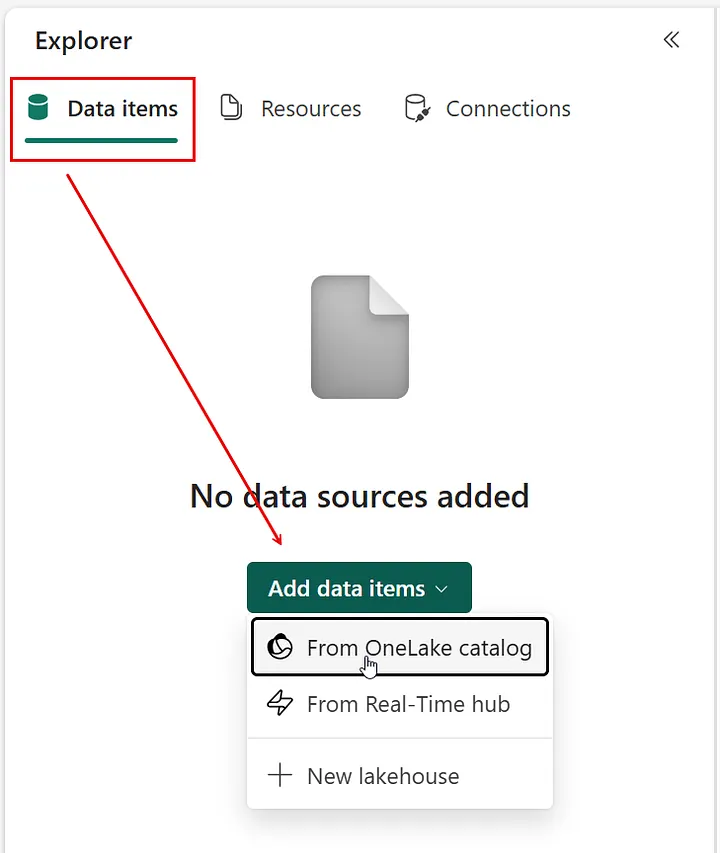
*Figura 5 — Add a new data item to the evaluation notebook (by the author)*

3. Seleziona il Lakehouse **`evaluation`** (quello con l'icona a onde) e clicca su **Add**.

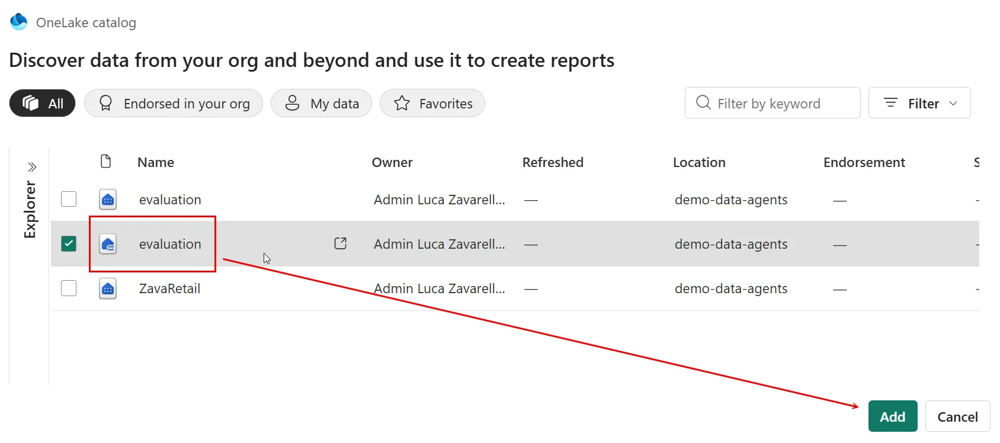
*Figura 6 — Add the evaluation lakehouse as default lakehouse (by the author)*

> ✅ **Check:** il Lakehouse `evaluation` compare nel pannello Explorer del notebook come data item.

---

## Step 8 – Esecuzione della valutazione

### Cella 3 – Configurazione e avvio della valutazione

```python
# Nome del Data Agent
data_agent_name = "zava-agent"

# (Opzionale) Nome del workspace se il Data Agent è in un workspace diverso
workspace_name = None

# Nome della tabella di output per i risultati
# Verranno create due tabelle:
# - "<evaluation_table_name>": contiene i risultati aggregate (accuracy)
# - "<evaluation_table_name>_steps": contiene il dettaglio step-by-step
evaluation_table_name = "zava_agent_evaluation_output"

# Stage del Data Agent: "production" se pubblicato, "sandbox" altrimenti
data_agent_stage = "sandbox"

from fabric.dataagent.evaluation import evaluate_data_agent

# Esegui la valutazione e ottieni l'evaluation ID univoco
evaluation_id = evaluate_data_agent(
    df,
    data_agent_name,
    workspace_name=workspace_name,
    table_name=evaluation_table_name,
    data_agent_stage=data_agent_stage
)

print(f"Unique ID for the current evaluation run: {evaluation_id}")
```

L'evaluation ID è univoco per ogni run. Se esegui il benchmark più volte, ogni esecuzione genera un ID diverso, e tutte vengono accumulate nelle stesse tabelle Lakehouse.

Al termine dell'esecuzione, aggiorna la cartella **Tables** nel Lakehouse `evaluation`: dovranno comparire le due tabelle create automaticamente dall'SDK.

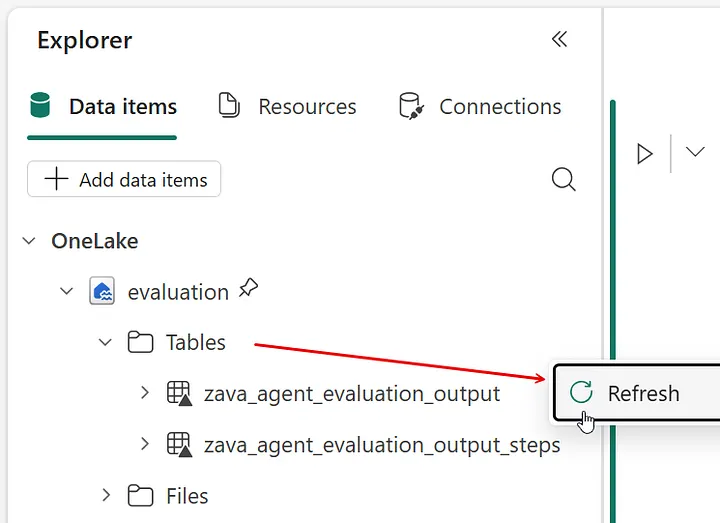
*Figura 7 — Evaluation tables created in the default lakehouse (by the author)*

> ⚠️ **Attenzione:** la prima esecuzione del benchmark completo richiede diversi minuti. Non interrompere il notebook durante l'esecuzione.

> ✅ **Check:** il notebook ha completato l'esecuzione senza errori e le due tabelle sono visibili nel Lakehouse `evaluation`.

---

## Step 9 – Lettura del primo verdetto: summary metrics

```python
from fabric.dataagent.evaluation import get_evaluation_summary

summary_df = get_evaluation_summary(
    table_name=evaluation_table_name,
    verbose=False
)

summary_df
```

La funzione restituisce le metriche aggregate: totale domande valutate, conteggi correct/incorrect/unclear e accuracy complessiva.

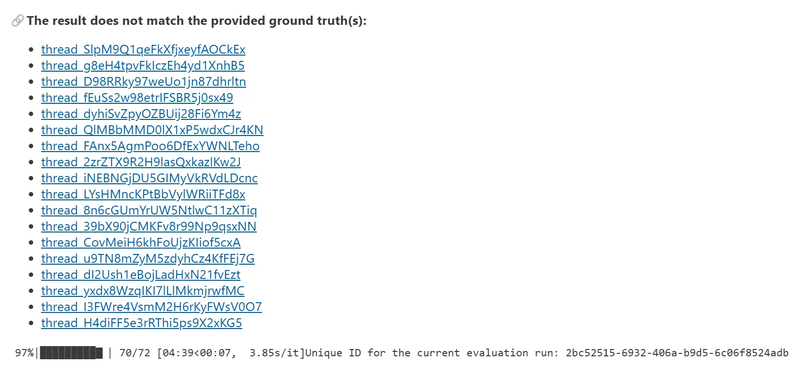
*Figura 8 — Results that don't match the ground truth (by the author)*

> 💡 È possibile cliccare sui link presenti nell'output per vedere il dettaglio della risposta dell'agente per ogni domanda.

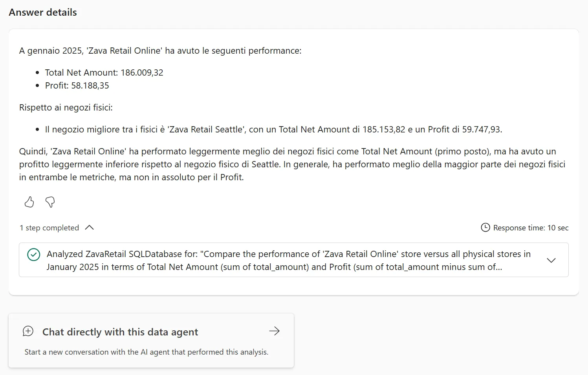
*Figura 9 — Example of one thread highlighted by the evaluation (by the author)*

Dopo alcune correzioni al file benchmark (vedi Step 11), il summary dovrebbe apparire più coerente:

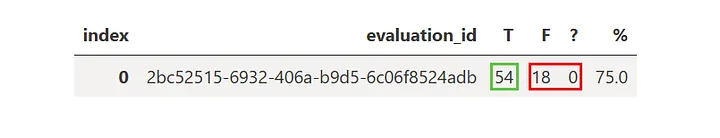
*Figura 10 — Evaluation high-level summary (by the author)*

Con un benchmark correttamente compilato, il risultato tipico è circa **75% di accuracy** su 72 domande.

> ✅ **Check:** `summary_df` mostra il totale delle domande valutate e l'accuracy complessiva.

---

## Step 10 – Dettaglio row-level con `get_evaluation_details`

```python
from fabric.dataagent.evaluation import get_evaluation_details

details_df = get_evaluation_details(
    evaluation_id=evaluation_id,
    table_name=evaluation_table_name,
    get_all_rows=True
)

details_df
```

Questa funzione restituisce per ogni riga: la domanda originale, l'`expected_answer`, l'`actual_answer`, il verdetto (`true`, `false`, `unclear`) e un `thread_url` che punta alla conversazione di valutazione.

### Export del dettaglio in Excel

```python
import os
from datetime import datetime

folder = "/lakehouse/default/Files/exports"
os.makedirs(folder, exist_ok=True)

filename = f"benchmark_export_{datetime.now():%Y%m%d_%H%M%S}.xlsx"
out_path = os.path.join(folder, filename)

details_df.to_excel(out_path, index=False, sheet_name="Benchmark")

print("Created:", out_path)
print("Exists?", os.path.exists(out_path))
```

> 💡 La libreria `openpyxl` è già pre-installata nell'ambiente Fabric notebook di default.

### Costruzione della tabella di audit con `question_id`

Il file esportato da `get_evaluation_details` non contiene il riferimento ai `question_id` del benchmark. Il codice seguente esegue il merge tra l'export SDK e il benchmark originale per recuperarli:

```python
import pandas as pd
import numpy as np
from datetime import datetime

export_path = "/lakehouse/default/Files/exports/benchmark_export_<timestamp>.xlsx"  # adatta
benchmark_path = "/lakehouse/default/Files/final_benchmark_with_expected_answers.xlsx"
output_xlsx = f"/lakehouse/default/Files/audit_table_{datetime.now():%Y%m%d_%H%M%S}.xlsx"

exp = pd.read_excel(export_path)
bench = pd.read_excel(benchmark_path)

audit = exp.merge(
    bench[["intent_id", "question_id", "question", "expected_answer"]],
    on="question",
    how="left",
    suffixes=("", "_bench")
)

canon_map = (
    bench.groupby("intent_id")["expected_answer"]
    .apply(lambda s: next((x for x in s if pd.notna(x)), np.nan))
    .to_dict()
)

audit["expected_answer_final"] = audit["expected_answer"]
mask = audit["expected_answer_final"].isna()
audit.loc[mask, "expected_answer_final"] = audit.loc[mask, "intent_id"].map(canon_map)

final = audit[[
    "question_id", "evaluation_id", "question",
    "expected_answer_final", "actual_answer",
    "evaluation_message", "thread_url"
]].copy()

final = final.rename(columns={
    "question": "query",
    "expected_answer_final": "expected_answer",
    "evaluation_message": "sdk_verdict"
})

final = final.sort_values("question_id").reset_index(drop=True)
final.to_excel(output_xlsx, index=False)
print(f"Saved: {output_xlsx}")
```

> ✅ **Check:** il file Excel di audit è stato esportato nel Lakehouse e descargato. Sono visibili le colonne `question_id`, `sdk_verdict`, `actual_answer` e `thread_url`.

---

## Step 11 – Analisi della stabilità del validator

Eseguire il benchmark più volte con le stesse impostazioni aiuta a capire se i risultati sono stabili o variano in modo significativo:

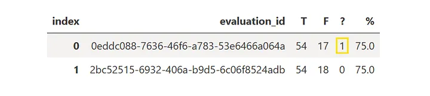
*Figura 11 — Multiple evaluation summaries (by the author)*

Due cause principali di variabilità sono:

1. **Non-determinismo del modello LLM** nel valutare le risposte: il path interno dell'SDK usa GPT-4o come giudice, non GPT-4.1.
2. **Problemi nel file benchmark**: errori o inconsistenze nella colonna `expected_answer` possono far apparire il validator più fragile di quanto sia realmente.

> ⚠️ **Lezione importante:** se i risultati iniziali sembrano troppo pessimistici, ricontrolla prima il file benchmark prima di attribuire tutti i problemi al validator. Nella nostra esperienza, dopo aver corretto alcuni problemi nel file Excel, la stabilità del validator è migliorata significativamente.

---

## Step 12 – Analisi del critic prompt e personalizzazione

### Il critic prompt di default

Un'ispezione del codice sorgente dell'SDK rivela il prompt di valutazione built-in:

```
Given the following query and ground truth, please determine if the most recent answer
is equivalent or satifies the ground truth. If they are numerically and semantically
equivalent or satify (even with reasonable rounding), respond with "Yes". If they clearly
differ, respond with "No". If it is ambiguous or unclear, respond with "Unclear".
Return only one word: Yes, No, or Unclear..

Query: {query}

Ground Truth: {expected_answer}
```

Tre dettagli rilevanti emersi dall'ispezione:

1. **Il prompt è intenzionalmente minimalista** e generico. Funziona come baseline, ma può essere fragile su output complessi.
2. **Contiene piccoli typo** (`satifies` invece di `satisfies`, `satify` invece di `satisfy`, doppio punto finale). Non compromettono il funzionamento ma segnalano che anche i default SDK devono essere ispezionati prima di essere trattati come autorevoli.
3. **Il parsing del verdetto è brittle**: l'SDK fa un semplice substring check sul testo restituito (`"no"` → `False`, `"yes"` → `True`, altro → `None`/unclear). Se il modello risponde con una frase invece di una parola sola, il risultato può essere classificato in modo errato.

### Il placeholder `{actual_answer}` non funziona

Alcuni esempi online mostrano l'uso di `{actual_answer}` in un critic prompt custom:

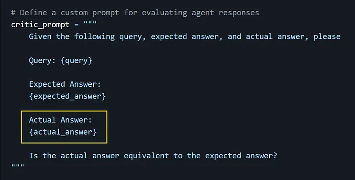
*Figura 12 — Example of the incorrect use of the {actual_answer} placeholder (by the author)*

Un'ispezione del codice sorgente SDK (versione `0.1.19a0`) conferma che `actual_answer` viene prodotto e salvato nella tabella di output, ma **non viene iniettato nel template del critic_prompt**. Usare `{actual_answer}` in un critic prompt custom genera un errore. Solo `{query}` e `{expected_answer}` sono supportati.

### Esperimento con critic prompt custom

È possibile fornire un critic prompt personalizzato tramite il parametro `critic_prompt` di `evaluate_data_agent`:

```python
from fabric.dataagent.evaluation import evaluate_data_agent

critic_prompt_custom = """
Given the following query and ground truth, please determine if the most recent answer is equivalent and contains the same required information as the ground truth.

Ignore differences in wording, formatting, Markdown, quotation marks, table versus list style, row order and other non-contradictory details.

If the required entities, metrics and values are the same and semantically equivalent, even with reasonable rounding, respond with 'Yes'. If they differ, respond with 'No'. If it is ambiguous or unclear, respond with 'Unclear'. Only return one word: 'Yes', 'No', or 'Unclear'.

Query: {query}

Ground Truth: {expected_answer}
"""

evaluation_id = evaluate_data_agent(
    df[["question", "expected_answer"]],
    data_agent_name,
    workspace_name=workspace_name,
    table_name=evaluation_table_name,
    data_agent_stage=data_agent_stage,
    critic_prompt=critic_prompt_custom
)

print(f"Evaluation ID: {evaluation_id}")
```

> ⚠️ **Risultato sorprendente:** aggiungere istruzioni apparentemente ragionevoli al critic prompt (come "ignora differenze di formato") ha prodotto nella nostra esperienza un'accuracy **peggiore** (68.1% vs 75.0%) rispetto al prompt di default.

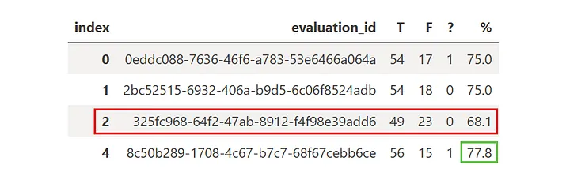
*Figura 13 — Worse performance using our custom critic prompt (by the author)*

Questo dimostra che i critic prompt custom devono essere trattati come **esperimenti controllati**, non come miglioramenti automatici. Con GPT-4o come giudice, anche una rifinazione apparentemente ovvia può spostare il decision boundary in modo imprevedibile. Tratta il default come baseline, verifica su benchmark pulito, e sperimenta con cautela.

> ✅ **Check:** hai eseguito almeno 3 run del benchmark. Hai confrontato i summary e compreso le possibili cause di variabilità. Hai eventualmente sperimentato con un critic prompt custom e documentato il risultato.

---

## Configurazione del file di tracking consigliata

Per tracciare l'evoluzione dell'agente nel tempo, mantenere una struttura multi-run nel file Excel:

| question_id | intent_id | Domanda | Risposta attesa | Risposta agente (run 1) | Verdetto (run 1) | Risposta agente (run 2) | Verdetto (run 2) |
|---|---|---|---|---|---|---|---|
| Q001 | I01 | Qual è il fatturato netto... | 12.345,67 € | 12.345,67 € | ✅ | ... | ... |
| Q002 | I01 | Dimmi il fatturato netto... | 12.345,67 € | ... | 🟡 | ... | ... |

---

## Done Criteria

Prima di considerare il Lab 03 completato:

- [ ] Regola `best-selling` aggiunta alle Agent instructions del `zava-agent`
- [ ] `final_benchmark_with_expected_answers.xlsx` scaricato o compilato correttamente
- [ ] Lakehouse `evaluation` creato nel workspace
- [ ] File Excel benchmark caricato nella sezione Files del Lakehouse
- [ ] Notebook `zava_agent_evaluation` creato con kernel Python
- [ ] Lakehouse `evaluation` aggiunto come default lakehouse del notebook
- [ ] `fabric-data-agent-sdk` installato nel notebook
- [ ] `evaluate_data_agent` eseguito correttamente almeno una volta
- [ ] Le due tabelle di output visibili nel Lakehouse dopo l'esecuzione
- [ ] `get_evaluation_summary` letto e accuracy calcolata
- [ ] `get_evaluation_details` letto e file Excel di audit esportato
- [ ] Audit table con `question_id` costruita tramite merge
- [ ] Almeno 3 run eseguiti per valutare la stabilità del validator
- [ ] Critic prompt default analizzato e limitazioni documentate

---

## Troubleshooting frequente

| Problema | Causa probabile | Soluzione |
|---|---|---|
| `capacity limit exceeded` durante la valutazione | F2 non è sufficiente per esecuzioni ripetute del benchmark | Usa almeno F4; considera una capacity dedicata per produzione |
| `evaluate_data_agent` fallisce senza messaggio chiaro | Nessun Lakehouse default impostato nel notebook | Aggiungi il Lakehouse `evaluation` come data item dal pannello Explorer |
| Il placeholder `{actual_answer}` genera errore nel critic prompt | Non è supportato dall'SDK `0.1.19a0` | Usa solo `{query}` e `{expected_answer}` nel critic prompt custom |
| Accuracy molto bassa su tutti i run (< 50%) | Possibili errori nel file `expected_answer` | Ricontrolla il file benchmark prima di attribuire tutto al validator o all'agente |
| Verdict instabili tra run (stesso benchmark, risultati diversi) | Non-determinismo GPT-4o + parsing brittle del SDK | È normale per variazioni piccole; variazioni > 15% suggeriscono problemi nel benchmark o prompt |
| L'agente risponde in inglese su domande in italiano | Regola multilingua nelle Agent instructions mancante | Verifica le Agent instructions del Lab 02 |
| Tabelle di output non compaiono nel Lakehouse | L'esecuzione è stata interrotta o la capacity è andata in throttling | Verifica i log del notebook; ritenta con capacità adeguata |
| Il file Excel di audit manca delle colonne `question_id` | `get_evaluation_details` non le include nativamente | Usa il codice di merge con il benchmark originale (Step 10) |

---

## Nota sul Non-Determinismo e sulla Validità Statistica

Il `zava-agent` usa un LLM (attualmente GPT-4.1) per generare SQL, e l'SDK usa GPT-4o come giudice della valutazione. Entrambi i modelli sono non deterministici.

Implicazioni operative:

- Un singolo run produce una **stima puntuale**, non una misura assoluta.
- Differenze di ±5% tra run consecutive sono normali; differenze > ±15% suggeriscono instabilità sistemica.
- Per una stima più robusta, esegui il benchmark almeno **3 volte** e calcola media e deviazione standard.
- Prima di modificare la configurazione dell'agente in risposta a risultati negativi, assicurati che il benchmark file sia corretto.

---

## Prossimo Step

➡️ **Lab 04 – Audit Row-Level dei Verdetti di Valutazione**

Il prossimo laboratorio (se disponibile) analizza quali domande cambiano verdetto tra run diverse, perché cambiano, e cosa questo rivela sulla robustezza reale del Fabric Data Agent e sul comportamento del validator. Questo livello di analisi consente di separare i fallimenti genuini dell'agente dall'ambiguità residua del benchmark e del processo di valutazione.