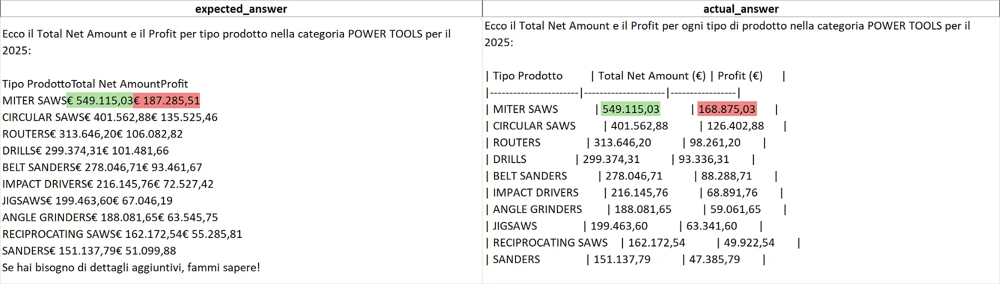
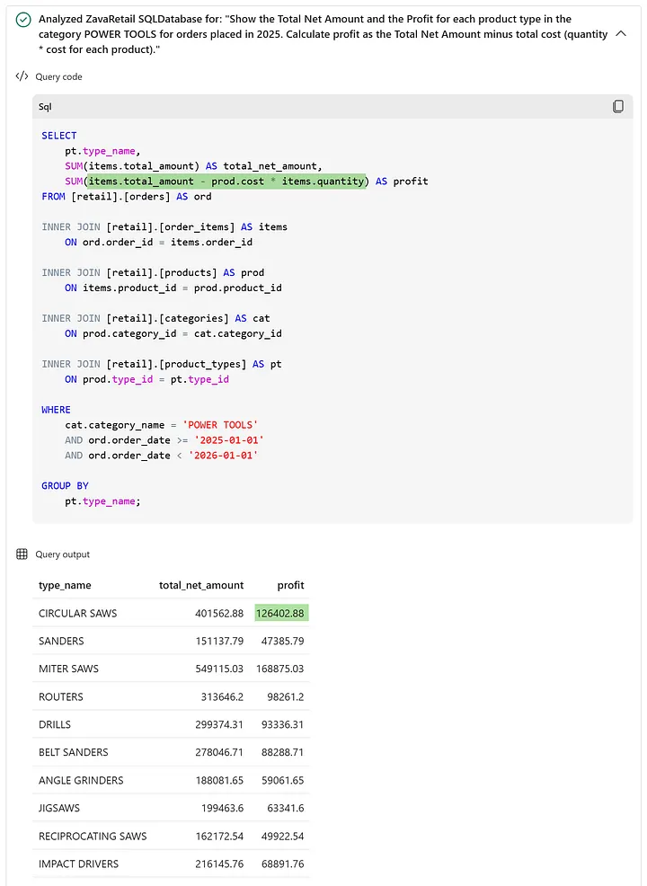
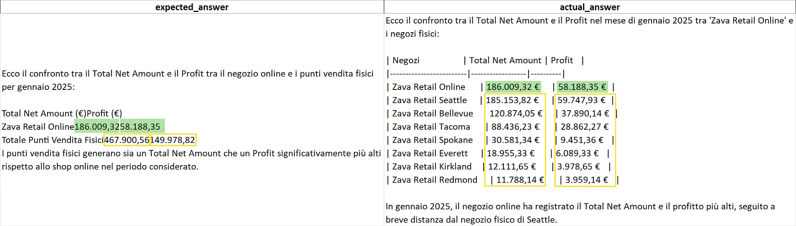
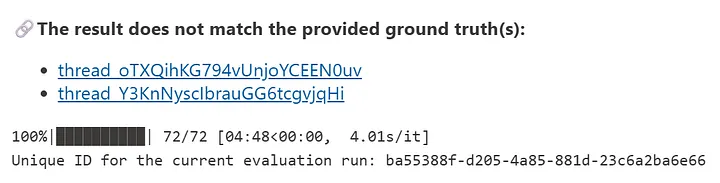
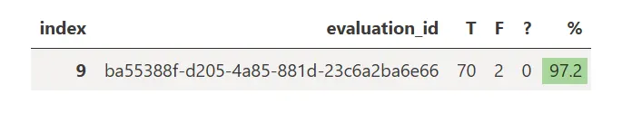

# Lab 04 – Audit Row-Level dei Verdetti di Valutazione

> **Prerequisiti**
> - Lab 01 completato: SQL Database `ZavaRetail` presente in Fabric con SQL Analytics Endpoint attivo
> - Lab 02 completato: Data Agent `zava-agent` configurato con istruzioni, data source description ed example queries
> - Lab 03 completato: benchmark da 72 domande eseguito almeno una volta tramite `evaluate_data_agent`; audit artifact (`audit_table_*.xlsx`) esportato con colonne `question_id`, `evaluation_id`, `query`, `expected_answer`, `actual_answer`, `sdk_verdict`, `thread_url`
> - Accesso al workspace `ZavaRetail` (o il workspace equivalente)
> - Microsoft Excel, Google Sheets o qualsiasi tool in grado di aprire file `.xlsx`
> - Fabric Capacity F4 o superiore raccomandata per la riesecuzione del benchmark
>
> **Durata stimata:** 120–180 minuti
>
> **Risultato atteso:** un'analisi row-level completa dei verdetti negativi del benchmark, con classificazione strutturata dei failure mode, correzione del benchmark e della configurazione del Data Agent, e riesecuzione che porta l'accuracy da circa 75% a circa 97%.

---

## Contesto

Nel Lab 03 abbiamo eseguito il benchmark da 72 domande tramite il workflow ufficiale Fabric `evaluate_data_agent` e ottenuto una baseline di accuratezza. Il numero ha fatto il suo lavoro: ci ha dato un punto di partenza misurabile e ha evidenziato che circa un quarto delle domande non riceveva la risposta attesa.

Ma una percentuale di accuracy, da sola, non spiega nulla. Non distingue tra un errore del Data Agent e un errore del benchmark stesso. Non dice se il problema è nel wording della domanda, nella formula della metrica, nella gestione delle percentuali o in qualcosa di più fondamentale come la capacità dell'agente di interpretare correttamente il perimetro di aggregazione richiesto.

L'obiettivo di questo lab è scendere a livello di riga.

Una volta che il benchmark è stato corretto e la valutazione è stata rieseguita più volte fino a stabilizzarsi, l'utilità più alta che il benchmark può darci non è il numero: è una visione strutturata di come l'agente fallisce. Questo è il momento in cui il benchmark smette di essere uno strumento di misura e diventa uno strumento di diagnosi.

Il processo che seguiremo è questo: prendere l'audit artifact costruito nel Lab 03, filtrare i verdetti negativi, aprire i thread corrispondenti, ispezionare le query SQL generate dall'agente, classificare il failure mode e decidere se l'azione correttiva riguarda il benchmark, le istruzioni dell'agente, o entrambi.

> 📄 [Which Verdicts Changed, and Why: a Row-Level Audit of Fabric Data Agent Evaluation](https://medium.com/data-science-collective/which-verdicts-changed-and-why-a-row-level-audit-of-fabric-data-agent-evaluation-01b0f1969a71?sk=a5689fb31b66394060486734478e0e88)

---

## Parte 1 – Preparazione dell'audit trail

### Da dove partiamo

Non è necessario rieseguire l'estrazione da zero. Nel Lab 03 abbiamo già costruito un audit artifact completo a partire da `get_evaluation_details`, con il merge che aggiunge il `question_id` dal benchmark originale.

Il file di partenza per questo lab è quello esportato nell'ultimo Step 10 del Lab 03: `audit_table_*.xlsx`.

Se non hai il file disponibile, puoi ricostruirlo eseguendo di nuovo il codice di merge del Lab 03 a partire dall'ultima evaluation run.

### Le colonne minime dell'audit artifact

| Colonna | Descrizione |
|---|---|
| `question_id` | Identificativo stabile della domanda nel benchmark |
| `evaluation_id` | Identificativo dell'evaluation run |
| `query` | Testo della domanda posta all'agente |
| `expected_answer` | Risposta attesa (ground truth) |
| `actual_answer` | Risposta prodotta dal Data Agent |
| `sdk_verdict` | Verdetto del validator (`true`, `false`, `unclear`) |
| `thread_url` | Link alla conversazione di valutazione nel workspace Fabric |

> ✅ **Check:** hai il file `audit_table_*.xlsx` aperto. Tutte e sette le colonne sono presenti e popolate.

---

## Parte 2 – Filtrare le righe con verdetto negativo

### Step 1 – Costruire la working table

Il primo passo operativo è isolare le righe dove l'agente non ha soddisfatto il validator, cioè le righe con `sdk_verdict = false`.

In Excel, puoi farlo direttamente con un filtro sulla colonna `sdk_verdict`:

1. Apri `audit_table_*.xlsx`.
2. Applica un **AutoFilter** sulle colonne.
3. Filtra `sdk_verdict` su `false`.

In alternativa, se preferisci lavorare in Python nel notebook del Lab 03:

```python
import pandas as pd

audit = pd.read_excel("/lakehouse/default/Files/audit_table_<timestamp>.xlsx")

failures = audit[audit["sdk_verdict"].str.lower() == "false"].copy()
failures = failures.sort_values("question_id").reset_index(drop=True)

print(f"Righe con verdetto negativo: {len(failures)}")
display(failures[["question_id", "query", "sdk_verdict", "thread_url"]])
```

> ✅ **Check:** hai la lista delle domande con verdetto negativo. Per una prima run tipica del benchmark con il file originale, il numero atteso è intorno a 18–20 righe.

---

## Parte 3 – Classificare i failure mode

### Step 2 – Schema di classificazione

Prima di aprire un singolo thread, è utile avere uno schema mentale dei failure mode possibili. Non tutti i verdetti negativi sono errori dell'agente. Nella nostra esperienza con il benchmark ZavaRetail, i fallimenti si distribuiscono in sette categorie:

| Codice | Failure mode | Descrizione sintetica |
|---|---|---|
| `BENCH_WRONG` | Benchmark wrong | La risposta dell'agente è corretta ma il `expected_answer` è sbagliato |
| `SCOPE_DRIFT` | Wrong scope / wrong granularity | L'agente risponde a una domanda correlata ma non a quella richiesta |
| `FALSE_NO_DATA` | False no-data | L'agente afferma che non esistono dati quando invece esistono |
| `PCT_SCALE` | Percentage scale error | Errore di scala ×100 nella gestione delle percentuali |
| `METRIC_DEF` | Metric definition drift | L'agente usa una formula diversa da quella business approvata |
| `SUBSET_NAMING` | Subset naming ambiguity | Phrasing ambiguo porta l'agente a misinterpretare il ruolo schema di un'entità |
| `FILTER_BREAKDOWN` | Filter scope treated as breakdown | L'agente espande un filtro in una dimensione di raggruppamento non richiesta |

In pratica, la classificazione avviene aprendo il `thread_url` corrispondente, leggendo la query SQL generata e confrontandola con il `expected_answer`.

> 💡 **Metodo di lavoro consigliato:** aggiungi una colonna `failure_mode` all'audit table Excel e compilala man mano che esamini ogni riga. Aggiungi anche una colonna `action` (es. `fix_benchmark`, `fix_agent_instructions`, `fix_both`, `fix_wording`) per tracciare l'intervento necessario.

> ✅ **Check:** hai aggiunto le colonne `failure_mode` e `action` alla working table Excel.

---

## Parte 4 – Analisi dei casi concreti

### Caso 1 – EXT03_\* : quando il benchmark è sbagliato (BENCH_WRONG)

Il cluster EXT03_\* chiede il Total Net Amount e il Profit per tipo di prodotto nella categoria POWER TOOLS nel 2025.

Aprendo i thread corrispondenti e ispezionando la query SQL generata dall'agente, si osserva che la logica di calcolo è consistente con la definizione business approvata:

```sql
-- Profit = SUM(items.total_amount - products.cost * items.quantity)
```

La risposta dell'agente è riproducibile, stabile e allineata alla definizione congelata nel Lab 03. Il problema è upstream: la colonna `expected_answer` del benchmark era stata popolata con valori sbagliati.

**Azione:** correggere `expected_answer` per tutti e quattro i variant del cluster EXT03_\* con i valori corretti mostrati in Figura 1.


*Figura 1 — Correct expected answer values for the EXT03 cluster*

Il nuovo valore da inserire in `expected_answer` per le quattro varianti è:

```
Ecco il Total Net Amount e il Profit per tipo di prodotto nella categoria POWER TOOLS nel 2025:

Tipo Prodotto           Total Net Amount  Profit
MITER SAWS              €549.115,03       €168.875,03
CIRCULAR SAWS           €401.562,88       €126.402,88
ROUTERS                 €313.646,20       €98.261,20
DRILLS                  €299.374,31       €93.336,31
BELT SANDERS            €278.046,71       €88.288,71
IMPACT DRIVERS          €216.145,76       €68.891,76
JIGSAWS                 €199.463,60       €63.341,60
ANGLE GRINDERS          €188.081,65       €59.061,65
RECIPROCATING SAWS      €162.172,54       €49.922,54
SANDERS                 €151.137,79       €47.385,79

Se vuoi approfondire uno specifico tipo di prodotto, fammi sapere!
```

> ⚠️ **Lezione benchmark:** se la ground truth è stata popolata da una risposta precedente dell'agente e quella risposta era sbagliata o instabile, l'errore si incapsula nel benchmark. Da quel momento, ogni valutazione successiva penalizza la risposta corretta. L'unica difesa è ispezionare il SQL generato e confrontarlo con la query di riferimento eseguita direttamente.

> ✅ **Check:** la colonna `expected_answer` è stata corretta nel file benchmark per tutte le varianti EXT03_\*.

---

### Caso 2 – EXT04, EXT05, INT04 : quando l'agente risponde alla domanda sbagliata (SCOPE_DRIFT)

Questi cluster mostrano un pattern diverso: l'agente non produce un risultato numerico sbagliato, ma risponde a una domanda correlata anziché a quella richiesta.

**EXT04_COL** chiede un confronto tra Zava Retail Online e il totale aggregato dei negozi fisici. L'agente restituisce invece i singoli store fisici in righe separate, espandendo ciò che doveva essere un blocco aggregato.

**EXT05_IMP** chiede un conteggio mensile di ordini distinti. L'agente restituisce valori molto più grandi, interpretando "order volume" come quantità di item venduti anziché come conteggio di ordini.

**INT04_EXE** chiede una vista mensile con campi analitici specifici (cumulativi, variazione del profit, gross margin, mese con net amount più alto). L'agente restituisce una tabella mensile, ma la forma dell'output si sposta verso una composizione analitica diversa.

**Azioni:**

1. Modificare le Agent instructions aggiungendo la regola sull'`order count`:

```markdown
- When the user asks for order count, number of orders, or order volume, you must count distinct orders, not items, quantities, or order lines, unless the user explicitly asks for quantity sold or item volume
```

2. Rafforzare la regola sulla granularità, sostituendo la versione attuale con:

```markdown
- Do not provide more granular details than requested, either in the SQL query or in the final answer.
```

> ✅ **Check:** le Agent instructions aggiornate contengono entrambe le nuove regole.

---

### Caso 3 – EXT09_COL, INT02_IMP : quando la risposta è "no data" su dati che esistono (FALSE_NO_DATA)

In questi casi l'agente non produce un risultato sbagliato: afferma direttamente che non esistono dati, quando il benchmark ha chiaramente una risposta attesa con valori validi.

**EXT09_COL** chiede un confronto del Total Net Amount per 'Ball Valve 1/2-inch' tra 2024 e 2025. L'agente risponde che non esistono dati rilevanti.

Aprendo il thread, la query SQL appare sintatticamente corretta. Il problema è nel valore della condizione:

```sql
WHERE prod.product_name = 'Ball Valve 1/2-Inch'
```

Il nome corretto nel database è `'Ball Valve 1/2-inch'` con la `i` minuscola. L'agente ha seguito correttamente la regola "title case", ma ha capitalizzato `inch` come parola indipendente anziché preservarne la forma minuscola originale.


*Figura 2 — Correct result set using lowercase "inch"*

**Azione:** aggiornare le Data source instructions con una regola più precisa per `product_name`:

```markdown
- The column [product_name] of table [retail].[products] generally uses title case, but you must preserve the exact stored casing of unit- and attribute-based suffixes. In particular, do not blindly convert the whole product name to generic title case. Some suffixes remain lowercase after a hyphen or measure token, such as "-inch", "-foot", "-piece", "-drive", and "-gauge", while others remain capitalized as stored, such as "-Amp", "-Arm", "-Quart", "-Bulb", "-Gallon", and "-Drawer". When generating SQL conditions on [product_name], always prefer the exact stored casing of the product name.
```

> 💡 **Best practice:** se sai già in anticipo che il data source sarà usato da un Data Agent, considera di configurare la collation come case-insensitive (es. `Latin1_General_100_CI_AS_KS_WS_SC_UTF8`) al momento della creazione. Questo elimina alla radice la categoria intera dei false no-data da case mismatch.

> ✅ **Check:** le Data source instructions sono state aggiornate con la nuova regola su `product_name`.

---

### Caso 4 – EXT10_\* : quando il benchmark è sbagliato e la percentuale è fragile (PCT_SCALE + BENCH_WRONG)

Questo cluster è particolarmente utile perché mescola due problemi distinti.

**Il primo problema** è nel benchmark: la `expected_answer` dichiarava `77%`, ma il valore corretto è `0.77%`. Tre delle quattro varianti stavano quindi penalizzando risposte corrette.

**Il secondo problema** è genuino: una delle varianti restituiva `77.2%` invece di `0.77%`. In quel caso, la query SQL aveva già prodotto un valore in scala percentuale, e il layer di risposta finale aveva applicato la moltiplicazione per 100 una seconda volta.

**Azione 1 – Correggere il benchmark:**

```
Nel mese di gennaio 2025, il prodotto 'Ball Valve 1/2-inch' ha generato il 0.77% del Total Net Amount della categoria PLUMBING.
```

**Azione 2 – Aggiornare le Agent instructions per le percentuali:**

Aggiungere le seguenti cinque regole:

```markdown
- When computing a percentage, share, contribution, incidence, rate, or margin in SQL, always return the value as a raw decimal ratio, not as a value already multiplied by 100.
- When presenting a percentage-based result to the user during the rephrasing process, convert the raw decimal ratio into percentage format by multiplying by 100 and adding the % symbol.
- Do not apply the percentage conversion inside both the SQL query and the final answer. The SQL query must return the raw ratio; the final answer must apply the percentage formatting.
- When computing averages, rates, shares, or percentage-based measures in SQL, always use decimal arithmetic, for example by casting the input to DECIMAL or multiplying by 1.0 before aggregation or division.
- Unless the user explicitly requests a different precision, percentage values shown to the user must be rounded to two decimal places and displayed consistently in % format across the whole answer.
```

**Azione 3 – Aggiornare le domande per rendere esplicito il riferimento alla categoria:**

Per prevenire che il Data Agent interpreti PLUMBING come filtro su `product_description` invece che come categoria, riformulare tutte le varianti EXT10_\* in modo da rendere il riferimento alla categoria completamente esplicito:

| Question ID | Nuova formulazione |
|---|---|
| EXT10_CAN | Nel mese di gennaio 2025, quale percentuale del Total Net Amount della categoria PLUMBING è stata generata dal prodotto 'Ball Valve 1/2-inch'? |
| EXT10_COL | A gennaio 2025, che quota del Total Net Amount della categoria PLUMBING arriva da 'Ball Valve 1/2-inch'? |
| EXT10_EXE | Nel mese di gennaio 2025, quanto pesa il prodotto 'Ball Valve 1/2-inch' sul Total Net Amount complessivo della categoria PLUMBING? |
| EXT10_IMP | Dentro la categoria PLUMBING, a gennaio 2025, quanto incide 'Ball Valve 1/2-inch' sul netto totale? |

Applicare lo stesso principio anche alle domande EXT02_\* e EXT03_CAN che contengono riferimenti impliciti simili:

| Question ID | Nuova formulazione |
|---|---|
| EXT02_CAN | Quali sono i top 5 prodotti per Total Net Amount nella categoria PLUMBING nel 2025? |
| EXT02_COL | Mi dai i primi 5 prodotti della categoria PLUMBING per Total Net Amount nel 2025? |
| EXT02_EXE | Nel 2025, quali sono i 5 prodotti con il Total Net Amount più alto nella categoria PLUMBING? |
| EXT02_IMP | Sulla categoria PLUMBING nel 2025, quali sono i 5 prodotti che hanno portato più Total Net Amount? |
| EXT03_CAN | Calcola il Profit complessivo della categoria POWER TOOLS nel mese di gennaio 2025. All'interno della categoria, calcola anche il Profit generato solo dai prodotti di tipo JIGSAWS e la percentuale del Profit del tipo JIGSAWS sul totale. |

**Azione 4 – Aggiungere un'example query per la precisione decimale:**

Nel Data Agent, aggiungere la seguente example query per rinforzare la gestione delle percentuali non solo tramite istruzioni, ma anche tramite un pattern SQL concreto:

**Domanda:**
> *Quale categoria ha registrato l'average discount percent più alta nel mese di gennaio 2025?*

**SQL:**
```sql
SELECT TOP 1
    cat.category_name
    , AVG(items.discount_percent * 1.0) AS avg_discount_percent
FROM [retail].[orders] AS ord

    INNER JOIN [retail].[order_items] AS items
        ON ord.order_id = items.order_id

    INNER JOIN [retail].[products] AS prod
        ON items.product_id = prod.product_id

    INNER JOIN [retail].[categories] AS cat
        ON prod.category_id = cat.category_id

WHERE
    ord.order_date >= '2025-01-01'
    AND ord.order_date < '2025-02-01'

GROUP BY cat.category_name
ORDER BY avg_discount_percent DESC;
```

> ✅ **Check:** benchmark corretto per il cluster EXT10_\*. Agent instructions aggiornate con le cinque regole sulle percentuali. Nuova example query aggiunta al Data Agent.

---

### Caso 5 – EXT11_\* : quando il benchmark è sbagliato ma l'agente rivela comunque un'incomprensione metrica (BENCH_WRONG + METRIC_DEF)

Questo cluster chiede i top 3 prodotti pipe-related per Profit nel 2025.

La ground truth nel benchmark era sbagliata. La query di verifica corretta è:

```sql
SELECT TOP 3
      prod.product_name
    , SUM(items.total_amount) AS net_amount
    , SUM(prod.cost * items.quantity) AS cost
    , SUM(items.total_amount - prod.cost * items.quantity) AS profit
    , SUM(items.quantity) AS qty_sold
FROM [retail].[orders] AS ord
    INNER JOIN [retail].[order_items] AS items
        ON ord.order_id = items.order_id
    INNER JOIN [retail].[products] AS prod
        ON items.product_id = prod.product_id
WHERE
    prod.product_description LIKE '%pipe%'
    AND ord.order_date >= '2025-01-01'
    AND ord.order_date < '2026-01-01'
GROUP BY
    prod.product_name
ORDER BY
    profit DESC;
```


*Figura 3 — The true expected result set for EXT11*

Il nuovo valore di `expected_answer` per le varianti EXT11_\* è:

```
Ecco i top 3 prodotti pipe-related per Profit nel 2025:

Pipe Wrench Set – Profit: 10.570,58
Pre-Insulated Copper Pipe – Profit: 7.272,03
Copper Pipe 1-inch Type L – Profit: 6.779,39
```

**Il secondo problema** emerge però anche dopo aver corretto il benchmark. Per EXT11_EXE, l'agente genera:

```sql
SUM((items.unit_price - prod.cost) * items.quantity) AS total_profit
```

invece della formula approvata:

```sql
SUM(items.total_amount - prod.cost * items.quantity) AS profit
```

Questo non è un errore cosmetico: tratta il prezzo di listino come se fosse il ricavo netto realizzato, mescolando la logica di Total Net Amount con quella di Profit.

**Azioni:**

1. Aggiungere la definizione esplicita di **Profit** nelle Agent instructions, accanto alle definizioni già presenti per Total Gross Amount e Total Net Amount:

```markdown
- The **Profit** is the total value of ordered items after discounts, minus the total product cost, calculated as SUM(order_items.total_amount - products.cost * order_items.quantity).
```

2. Aggiornare l'alias nella example query Q1 già presente nel Data Agent, rinominando `net_amount` in `total_net_amount` per ridurre il rischio che l'agente confonda le etichette:

```sql
SELECT
    SUM(items.total_amount) AS total_net_amount
    , SUM(prod.cost * items.quantity) AS cost
    , SUM(items.total_amount - prod.cost * items.quantity) AS profit
FROM [retail].[orders] AS ord
    INNER JOIN [retail].[order_items] AS items
        ON ord.order_id = items.order_id
    INNER JOIN [retail].[products] AS prod
        ON items.product_id = prod.product_id
    INNER JOIN [retail].[categories] AS cat
        ON prod.category_id = cat.category_id
WHERE
    cat.category_name = 'PLUMBING'
    AND ord.order_date >= '2025-01-01'
    AND ord.order_date < '2025-02-01';
```

3. Correggere la variante implicita EXT11_IMP aggiungendo il vincolo di cardinalità mancante:

| Question ID | Nuova formulazione |
|---|---|
| EXT11_IMP | Nel 2025, quali primi 3 prodotti pipe-related spingono di più il Profit? |

> ✅ **Check:** benchmark corretto per EXT11_\*. Agent instructions aggiornate con la definizione di Profit. Alias `total_net_amount` aggiornato nell'example query Q1. Variante EXT11_IMP corretta.

---

### Caso 6 – INT03_\* : quando l'ambiguità del wording cambia il ruolo schema di un'entità (SUBSET_NAMING)

Il cluster INT03_\* chiede tre cose in una sola domanda:

- Profit totale per categoria POWER TOOLS in gennaio 2025
- Profit generato dal subset JIGSAWS
- Percentuale del subset sul totale

Quando la domanda usa esplicitamente l'espressione "prodotti di tipo JIGSAWS", l'agente esegue il calcolo correttamente perché può mappare JIGSAWS alla colonna `product_types.type_name`. Quando invece la variante usa "i JIGSAWS" senza specificare il ruolo schema, l'agente può interpretarlo come filtro su `product_name` invece che su `type_name`.

La soluzione qui non è aggiungere istruzioni all'agente, ma correggere il benchmark in modo che ogni variante preservi l'intenzione analitica in modo non ambiguo:

| Question ID | Nuova formulazione |
|---|---|
| INT03_COL | Mi servono il Profit totale di POWER TOOLS a gennaio 2025, il Profit generato dai prodotti di tipo JIGSAWS e il peso percentuale del tipo JIGSAWS sul totale. |
| INT03_IMP | Per POWER TOOLS a gennaio 2025, quanto vale il Profit totale e quanto incidono i prodotti di tipo JIGSAWS in valore e in percentuale? |

**Secondo problema** residuo: anche dopo aver reso esplicito il subset, l'agente può perdere i filtri del perimetro padre nei passaggi intermedi. Il sub-query per JIGSAWS può perdere il filtro sulla categoria, o il calcolo del denominatore della percentuale può perdere il filtro temporale.

**Azione:** aggiungere alle Agent instructions una regola esplicita sull'ereditarietà dei filtri:

```markdown
- When answering a multi-step question, every sub-query must preserve all explicit filters from the original question, including time period, category, type, store, channel, and any other parent scope, unless the user explicitly asks to change the scope.
```

> ✅ **Check:** varianti INT03_COL e INT03_IMP corrette nel benchmark. Agent instructions aggiornate con la regola sull'ereditarietà dei filtri.

---

### Caso 7 – Granularità: quando un filtro viene scambiato per una dimensione di raggruppamento (FILTER_BREAKDOWN)

Alcune domande analiticamente semplici ricevono risposte con granularità più bassa del previsto. I due pattern tipici osservati nel benchmark:

**Pattern A** – domanda su "tutti gli ordini in un periodo per un negozio" → agente restituisce una riga per ordine anziché un unico aggregato.

**Pattern B** – domanda su "prodotti della categoria X nel mese Y" → agente restituisce una riga per prodotto anziché il totale aggregato.

In entrambi i casi l'agente non sbaglia le entità di business né le metriche. Sbaglia l'interpretazione del ruolo della collezione riferita nella domanda: la tratta come dimensione di raggruppamento implicita invece che come perimetro di filtro.

**Azione:** sostituire la regola attuale sulla granularità con una versione più esplicita nelle Agent instructions:

```markdown
- Treat referenced collections such as all orders in a period, products in a category, online or physical stores, or sales in a store as filter scopes, not as requested breakdown dimensions. Unless the user explicitly asks for a breakdown by order, product, category, store, month, or any other dimension, you must return a single aggregate result at the highest level consistent with the requested metrics.
```

> ✅ **Check:** la regola di granularità nelle Agent instructions è stata sostituita con la versione rafforzata.

---

## Parte 5 – Configurazione aggiornata del Data Agent

Dopo tutte le modifiche effettuate durante l'audit, di seguito è riportata la configurazione completa e aggiornata del Data Agent.

### Agent instructions

```markdown
## Business language

- The **Total Gross Amount** is the total value of ordered items, calculated as quantity multiplied by unit price, before any discounts are applied.
- The **Total Net Amount** is the total value of ordered items after deducting all applied discounts, representing the effective revenue amount.
- The **Profit** is the total value of ordered items after discounts, minus the total product cost, calculated as SUM(order_items.total_amount - products.cost * order_items.quantity).
- The **Discount Impact Amount** is the absolute difference between Total Gross Amount and Total Net Amount, calculated as SUM(order_items.quantity * order_items.unit_price) - SUM(order_items.total_amount). It is an amount, not a percentage.
- When a users says "at the [city] store" they are referring to the store with the name "Zava Retail [city]".
- When a users says "[something] related products" they are referring to products whom description contains "[something]".
- When a users says "[something] product" they are referring to products whom name is "[something]".
- When computing a percentage, share, contribution, incidence, rate, or margin in SQL, always return the value as a raw decimal ratio, not as a value already multiplied by 100.
- When presenting a percentage-based result to the user during the rephrasing process, convert the raw decimal ratio into percentage format by multiplying by 100 and adding the % symbol.
- Do not apply the percentage conversion inside both the SQL query and the final answer. The SQL query must return the raw ratio; the final answer must apply the percentage formatting.
- Unless the user explicitly requests a different precision, percentage values shown to the user must be rounded to two decimal places and displayed consistently in % format across the whole answer.
- If two or more results have the same total quantity sold, you MUST break ties using the **Total Net Amount**, calculated as `SUM(total_amount)`, with the highest value ranked first.
- Do not interpret **best-selling** as highest revenue unless the user explicitly asks for revenue, net amount, or sales value.
- When the user asks for order count, number of orders, or order volume, you must count distinct orders, not items, quantities, or order lines, unless the user explicitly asks for quantity sold or item volume
- When the user asks how much a subset contributes to a total within a category, type, store, time period, or other filtered parent scope, you must preserve that same scope in every part of the calculation, including the final percentage denominator.
- When answering a multi-step question, every sub-query must preserve all explicit filters from the original question, including time period, category, type, store, channel, and any other parent scope, unless the user explicitly asks to change the scope.

## Generic instructions

- Treat referenced collections such as all orders in a period, products in a category, online or physical stores, or sales in a store as filter scopes, not as requested breakdown dimensions. Unless the user explicitly asks for a breakdown by order, product, category, store, month, or any other dimension, you must return a single aggregate result at the highest level consistent with the requested metrics.
- Always prefer to present complex data in a user-friendly table format, if possible.
- When computing averages, rates, shares, or percentage-based measures in SQL, always use decimal arithmetic, for example by casting the input to DECIMAL or multiplying by 1.0 before aggregation or division.
- If the user uses a language other than English:
    - When generating the SQL query, ALWAYS translate the user question into English during the rephrasing process.
    - You MUST translate all the strings said by the user related to products, categories, types, descriptions, etc. in English.
    - ALWAYS provide the final answer to the user in the same language that they used in their question.
```

### Data source instructions

```markdown
## Columns content
- Column [category_name] of table [retail].[categories]
    - For category names consider that the allowed values are ELECTRICAL, GARDEN & OUTDOOR, HAND TOOLS, HARDWARE, LUMBER & BUILDING MATERIALS, PAINT & FINISHES, PLUMBING, POWER TOOLS, STORAGE & ORGANIZATION. So, if the users are looking for a specific category, try to understand which of the previous one they are looking for

## Formatting used
When generating the SQL query, ALWAYS format any strings that are being used in conditions for the following columns:

- The column [category_name] of table [retail].[categories] contains values in uppercase
- The column [type_name] of table [retail].[product_types] contains values in uppercase
- The column [product_name] of table [retail].[products] generally uses title case, but you must preserve the exact stored casing of unit- and attribute-based suffixes. In particular, do not blindly convert the whole product name to generic title case. Some suffixes remain lowercase after a hyphen or measure token, such as "-inch", "-foot", "-piece", "-drive", and "-gauge", while others remain capitalized as stored, such as "-Amp", "-Arm", "-Quart", "-Bulb", "-Gallon", and "-Drawer". When generating SQL conditions on [product_name], always prefer the exact stored casing of the product name.
```

### Example queries

**Q1**
> *I need to calculate the net amount, total cost, and profit for products belonging to category PLUMBING in January 2025*

```sql
SELECT
    SUM(items.total_amount) AS total_net_amount
    , SUM(prod.cost * items.quantity) AS cost
    , SUM(items.total_amount - prod.cost * items.quantity) AS profit
FROM [retail].[orders] AS ord

    INNER JOIN [retail].[order_items] AS items
        ON ord.order_id = items.order_id

    INNER JOIN [retail].[products] AS prod
        ON items.product_id = prod.product_id

    INNER JOIN [retail].[categories] AS cat
        ON prod.category_id = cat.category_id

WHERE
    cat.category_name = 'PLUMBING'

    AND ord.order_date >= '2025-01-01'
    AND ord.order_date < '2025-02-01';
```

**Q2**
> *Quale categoria ha registrato l'average discount percent più alta nel mese di gennaio 2025?*

```sql
SELECT TOP 1
    cat.category_name
    , AVG(items.discount_percent * 1.0) AS avg_discount_percent
FROM [retail].[orders] AS ord

    INNER JOIN [retail].[order_items] AS items
        ON ord.order_id = items.order_id

    INNER JOIN [retail].[products] AS prod
        ON items.product_id = prod.product_id

    INNER JOIN [retail].[categories] AS cat
        ON prod.category_id = cat.category_id

WHERE
    ord.order_date >= '2025-01-01'
    AND ord.order_date < '2025-02-01'

GROUP BY cat.category_name
ORDER BY avg_discount_percent DESC;
```

---

## Parte 6 – Aggiornare il benchmark e rieseguire la valutazione

### Step 3 – Costruire `final_benchmark_with_expected_answers_v2.xlsx`

Tutte le correzioni identificate nella Parte 4 devono essere propagate nel file benchmark. Il file aggiornato è disponibile per comodità qui: [`final_benchmark_with_expected_answers_v2.xlsx`](https://github.com/lucazav/Measure-the-Real-Robustness-of-a-Fabric-Data-Agent-in-Italian/raw/refs/heads/main/final_benchmark_with_expected_answers_v2.xlsx).

Le modifiche riguardano due tipi di intervento:

| Tipo di modifica | Question IDs coinvolti |
|---|---|
| Correzione `expected_answer` | EXT03_\*, EXT10_\*, EXT11_\* |
| Correzione testo della domanda | EXT02_\*, EXT03_CAN, EXT10_\*, EXT11_IMP, INT03_COL, INT03_IMP |

Dopo aver salvato il file, caricalo nel Lakehouse `evaluation` sovrascrivendo il file precedente oppure aggiungendolo con il nuovo nome.

> ✅ **Check:** `final_benchmark_with_expected_answers_v2.xlsx` è salvato, caricato nel Lakehouse e visibile nella sezione Files.

### Step 4 – Rieseguire la valutazione con il benchmark corretto

Il workflow è identico a quello del Lab 03. La sola differenza è il file di input.

```python
from fabric.dataagent.evaluation import evaluate_data_agent
import pandas as pd

df = pd.read_excel(
    "abfss://<workspace_guid>@onelake.dfs.fabric.microsoft.com/<lakehouse_guid>/Files/final_benchmark_with_expected_answers_v2.xlsx"
)

data_agent_name = "zava-agent"
workspace_name = None
evaluation_table_name = "zava_agent_evaluation_output"
data_agent_stage = "sandbox"

evaluation_id = evaluate_data_agent(
    df[["question", "expected_answer"]],
    data_agent_name,
    workspace_name=workspace_name,
    table_name=evaluation_table_name,
    data_agent_stage=data_agent_stage
)

print(f"Unique ID for the current evaluation run: {evaluation_id}")
```

L'output dell'esecuzione dovrebbe già segnalare solo 2 risposte non corrispondenti al ground truth:


*Figura 4 — Output of the revised benchmark execution*

### Step 5 – Verificare il summary

```python
from fabric.dataagent.evaluation import get_evaluation_summary

summary_df = get_evaluation_summary(
    table_name=evaluation_table_name,
    verbose=False
)

ids_to_show = ["<evaluation_id_del_run_corrente>"]
summary_df[summary_df["evaluation_id"].isin(ids_to_show)]
```

Il risultato atteso è **70 True, 2 False**, corrispondente a un'accuracy del **97.2%**:


*Figura 5 — Summary statistics of the revised benchmark execution*

> ✅ **Check:** il summary mostra accuracy ≥ 97% per questa run.

---

## Parte 7 – Interpretare i due verdetti negativi residui

Anche con 97.2% di accuracy, due righe restano false. È utile capirle prima di chiudere il lab.

### Falso 1 – Domanda multi-step con payload analitico denso

Una delle due righe false è associata a un intent che combina in una sola domanda: vista mensile, totali cumulativi, variazione mese su mese del profit, gross margin, e identificazione del mese con il net amount più alto.

Il rephrasing del Data Agent chiarisce questa complessità espandendola in un'istruzione composita lunga. Si tratta esattamente del tipo di prompt che sarebbe difficile da gestire anche per un agente ben configurato: l'intenzione business è legittima, ma il payload analitico è abbastanza denso da generare una deriva nella composizione dell'output.

Questo fallimento non suggerisce un intervento immediato sul benchmark o sulle istruzioni. Indica piuttosto un limite architetturale legato alla complessità della domanda e al backend model.

### Falso 2 – Ruolo schema ambiguo in una variante implicita

La seconda riga false riguarda una variante con phrasing di questo tipo:

> *Su PLUMBING, a gennaio 2025, quanto abbiamo fatto di netto, costo e profitto?*

In questa formulazione, PLUMBING non è esplicitamente presentato come categoria. Il Data Agent può ragionevolmente interpretarlo come filtro su `product_name` invece che come `category_name`. Il comportamento è comprensibile ma sbagliato.

**Azione opzionale:** correggere la variante INT02_IMP nel benchmark per rendere il ruolo di PLUMBING esplicito, analogamente a quanto fatto per le varianti EXT10_\* e INT03_\*:

> *Nella categoria PLUMBING, a gennaio 2025, quanto abbiamo fatto di netto, costo e profitto?*

Questa correzione porterebbe potenzialmente l'accuracy a 72/72 su questa run specifica, ma non eliminerebbe la variabilità residua legata al non-determinismo del modello.

> ✅ **Check:** hai ispezionato entrambi i falsi residui e compreso le loro cause.

---

## Conclusioni

L'analisi row-level ha portato l'accuracy del benchmark da circa 75% a 97.2% senza interventi sul modello sottostante, ma attraverso tre canali distinti:

1. **Correzioni al benchmark:** errori nella ground truth che penalizzavano risposte corrette.
2. **Miglioramenti alle Agent instructions:** regole più precise su percentuali, granularità, ereditarietà dei filtri, order count.
3. **Miglioramenti alle Data source instructions:** regola più precisa sul casing di `product_name`.

La lezione centrale è che un benchmark non è definitivo al momento della sua prima compilazione. Il processo di audit row-level è parte integrante del ciclo di sviluppo del Data Agent: non si esegue una sola volta, ma ogni volta che l'agente viene modificato in modo significativo o che il dominio di dati evolve.

Anche con un risultato di 97.2%, rimane una variabilità residua legata al non-determinismo del backend model (GPT-4.1 al momento della scrittura). Alcune domande con phrasing ambiguo o payload analitico molto denso possono produrre risposte diverse in run successive. Questo non è eliminabile solo con prompt engineering: l'arrivo di modelli più stabili nella stessa pipeline Agent Service (come gpt-5 mini, quando disponibile nella propria region e deployment type) potrebbe ridurre questa variabilità in modo significativo.

---

## Done Criteria

Prima di considerare il Lab 04 completato:

- [ ] Audit artifact del Lab 03 disponibile con tutte e sette le colonne richieste
- [ ] Working table Excel con colonne `failure_mode` e `action` compilata per tutte le righe false
- [ ] Thread URL aperto e SQL generato ispezionato per ogni verdetto negativo
- [ ] Benchmark corretto per EXT03_\*, EXT10_\*, EXT11_\* (expected answer)
- [ ] Benchmark corretto per EXT02_\*, EXT03_CAN, EXT10_\*, EXT11_IMP, INT03_COL, INT03_IMP (wording)
- [ ] Agent instructions aggiornate: Profit, percentuali (5 regole), order count, filter inheritance, filter-as-breakdown
- [ ] Data source instructions aggiornate: regola product_name con suffissi lowercase
- [ ] Example query Q1 aggiornata con alias `total_net_amount`
- [ ] Example query Q2 aggiunta (AVG discount con `* 1.0`)
- [ ] `final_benchmark_with_expected_answers_v2.xlsx` salvato e caricato nel Lakehouse
- [ ] Benchmark v2 rieseguito almeno una volta senza errori
- [ ] Summary mostra accuracy ≥ 97%
- [ ] Due falsi residui ispezionati e cause documentate

---

## Troubleshooting Errori Comuni

| Problema | Causa probabile | Soluzione |
|---|---|---|
| Accuracy peggiora dopo le correzioni | Le modifiche al benchmark o alle istruzioni hanno introdotto nuove ambiguità | Esegui il benchmark almeno 3 volte e controlla la stabilità; confronta l'audit v1 con v2 riga per riga |
| `thread_url` non apre il thread corretto | Il thread appartiene a una evaluation run precedente non più accessibile | Ricontrolla che `evaluation_id` nella audit table corrisponda all'evaluation run che vuoi ispezionare |
| Dopo la correzione del product_name l'agente restituisce ancora no data | Il database usa collation case-sensitive su altri campi non ancora coperti dalle istruzioni | Ispeziona la query SQL generata e identifica il campo responsabile; aggiungi una regola specifica nelle Data source instructions |
| La regola sulle percentuali non viene rispettata | Le nuove Agent instructions non erano attive al momento dell'esecuzione (cache o stage) | Verifica che le istruzioni siano state salvate; per il sandbox stage, riavvia la sessione del notebook prima del run |
| Il falso residuo su PLUMBING persiste anche dopo la correzione di INT02_IMP | Non-determinismo del modello su formulazioni ancora parzialmente ambigue | Accetta il residuo o riformula la variante in modo ancora più esplicito; valuta se il costo di precisione supera il beneficio di naturalezza |
| Accuracy < 95% anche con il benchmark v2 | Possibile non-determinismo elevato del backend in alcune fasce orarie | Riesegui il benchmark in un momento diverso; calcola la media su 3 run consecutive |

---

## Nota sulla stabilità residua

Anche con il benchmark v2 e la configurazione aggiornata, l'accuracy su singolo run può variare leggermente. Questo è atteso: entrambi i modelli coinvolti (GPT-4.1 per la generazione delle risposte, GPT-4o per la valutazione) sono non deterministici.

In generale:
- Variazioni di ±2–3 punti percentuali tra run consecutive sono normali con questo benchmark.
- Variazioni > ±8 punti suggeriscono che qualche domanda è ancora sul bordo della zona di instabilità e merita ulteriore ispezione.

Se vuoi una stima più robusta dell'accuracy reale, esegui il benchmark almeno **3 volte** con il file v2 e riporta media e deviazione standard.

---

## Prossimo Step

➡️ **Lab 05 – Row-Level Security con Fabric Data Agent e Power BI Copilot**

Nel Lab 05 affrontiamo la sicurezza dei dati tramite Row-Level Security (RLS) di SQL Server. Il filtro viene applicato trasparentemente a livello del motore SQL basato sull'identità dell'utente: l'utente admin vede tutti i negozi, l'utente reader vede solo tre negozi specifici. Metteremo a confronto la stessa domanda dai due utenti verificando risultati diversi senza modifica al prompt, e concluderemo con una demo in Power BI Copilot.
