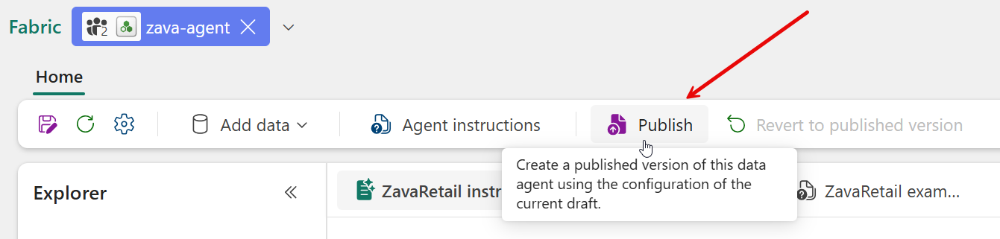
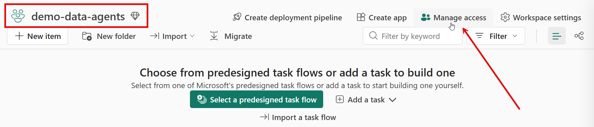
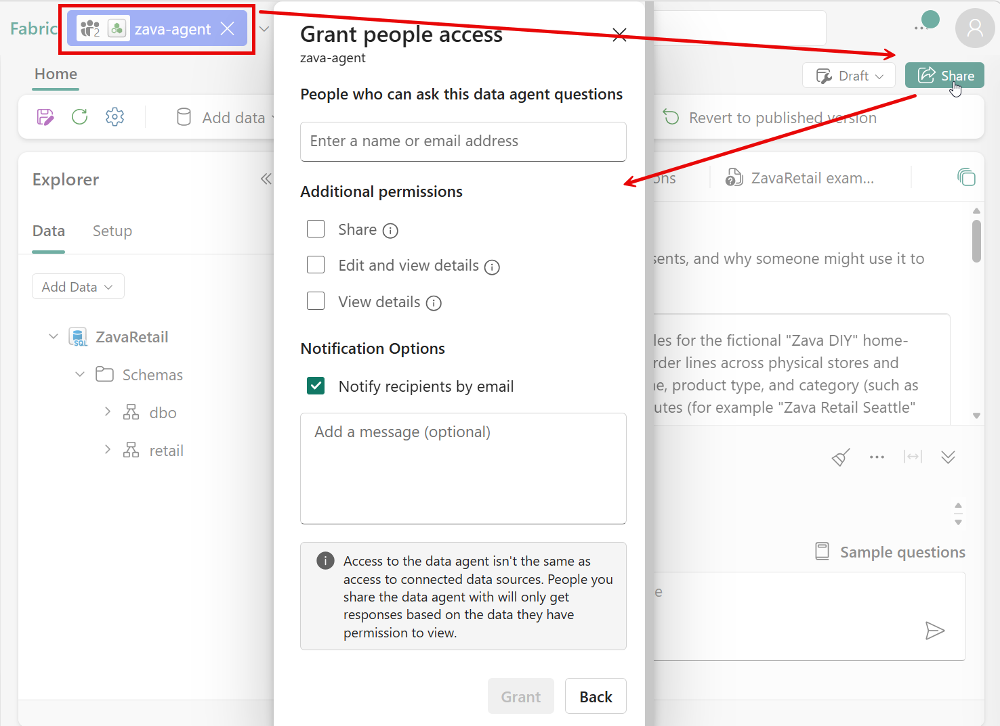
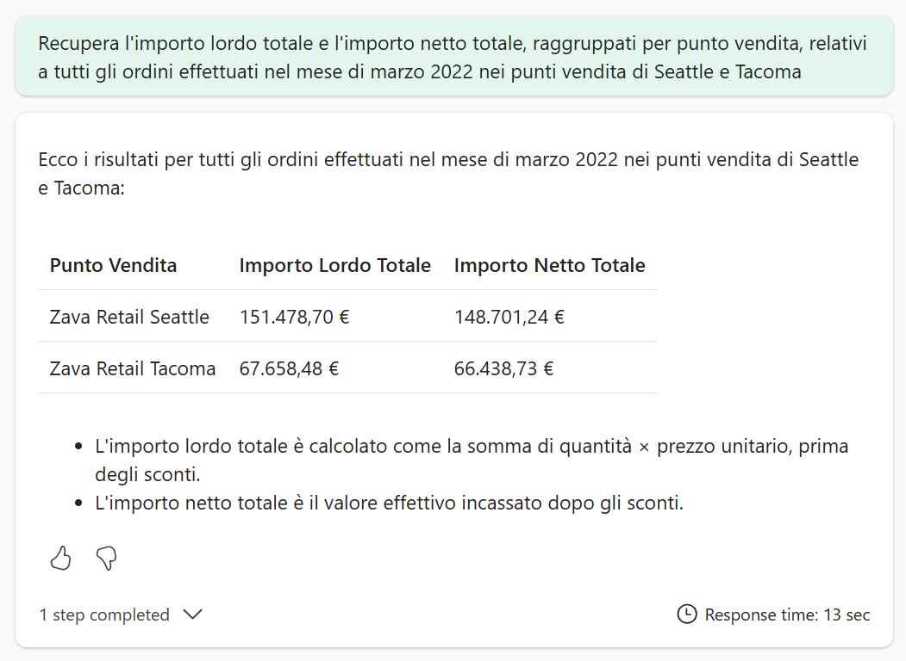
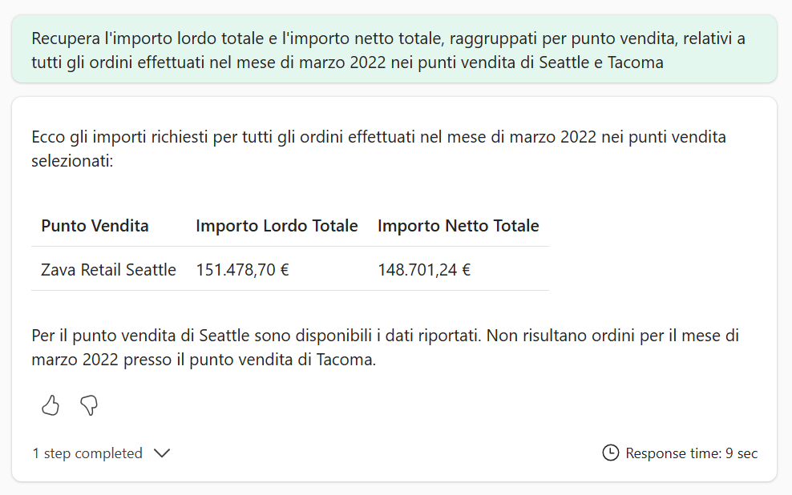
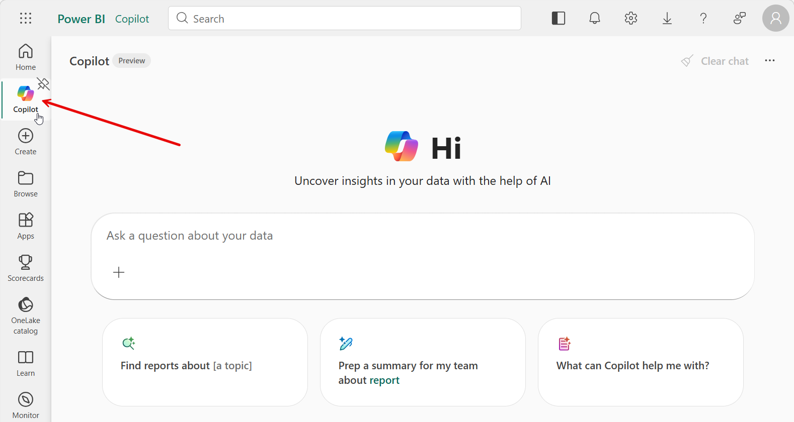
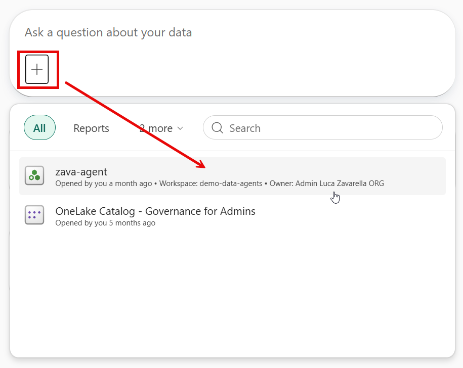
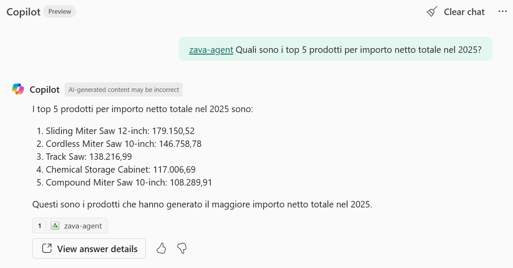

# Lab 05 – Row-Level Security con Fabric Data Agent e Power BI Copilot

> **Prerequisiti**
> - Lab 01 completato: SQL Database `ZavaRetail` presente in Fabric con SQL Analytics Endpoint attivo
> - Lab 02 completato: Data Agent `zava-agent` configurato con istruzioni, data source description ed example queries
> - Accesso al workspace `ZavaRetail` (o il workspace equivalente) con due utenti distinti:
>   - **admin** (`admin@lucazavarellaoutlook.onmicrosoft.com`): membro del workspace con ruolo sufficiente a creare e pubblicare il Data Agent
>   - **reader** (`reader@lucazavarellaoutlook.onmicrosoft.com`): utente Fabric a cui il Data Agent verrà condiviso
> - Due sessioni browser separate (es. finestra normale + finestra in incognito, oppure due profili browser distinti) per poter simulare i due utenti in parallelo
> - Accesso all'editor SQL del database `ZavaRetail` (query editor integrato in Fabric, SSMS, o Azure Data Studio)
>
> **Durata stimata:** 30–60 minuti
>
> **Risultato atteso:** la Row-Level Security (RLS) è attiva sulla tabella `[retail].[orders]`, il Data Agent `zava-agent` è pubblicato e condiviso con l'utente reader, e la demo comparativa mostra in modo visibile che la stessa domanda restituisce result set diversi in base all'identità dell'utente autenticato. Il lab si chiude con una dimostrazione rapida del Data Agent pubblicato dentro Power BI Copilot.

---

## Contesto

Nei lab precedenti abbiamo costruito, configurato e misurato la robustezza del `zava-agent`. In tutti quei test, l'agente rispondeva sempre come un unico utente: l'autore della configurazione. Ma cosa succede quando il Data Agent viene reso disponibile a più utenti con ruoli e permessi diversi?

Il punto chiave è questo: **il Data Agent genera sempre la stessa query SQL**, indipendentemente da chi fa la domanda. Non esiste un meccanismo nel prompt o nelle istruzioni che nasconde i dati a un utente e li mostra a un altro. Se vogliamo che utenti diversi vedano solo i dati a cui sono autorizzati, la sicurezza deve essere applicata a un livello inferiore, direttamente nel motore di query.

La **Row-Level Security (RLS)** di SQL Server (e quindi di Fabric SQL Database e dell'SQL Analytics Endpoint) è esattamente quel livello. La RLS inserisce un filtro automatico a livello di riga prima che qualsiasi risultato venga restituito: l'utente non può aggirarlo, non può vederlo nel SQL generato dall'agente, e non può neanche sapere con certezza quante righe vengono filtrate.

Il risultato pratico è elegante: il Data Agent lavora normalmente, genera query corrette, non sa nulla della policy di sicurezza, e la sicurezza funziona in modo trasparente. L'unica differenza visibile è il result set.

In questo lab vedremo questo meccanismo in azione con un esempio concreto: l'utente **admin** può vedere i dati di tutti i negozi, mentre l'utente **reader** può vedere solo i dati dei negozi di Seattle, Bellevue e Redmond.

---

## Parte 1 – Verificare l'identità dell'utente autenticato

Prima di configurare la RLS, è utile capire con quale identità il motore SQL identifica l'utente che sta eseguendo le query. Questa informazione è fondamentale perché la funzione RLS si baserà esattamente su questo valore.

### Step 1 – Eseguire `SELECT USER_NAME()`

Apri l'editor SQL del database `ZavaRetail` (puoi usare il query editor integrato in Fabric o SSMS) e lancia:

```sql
SELECT USER_NAME();
```

Il risultato mostrerà il principal con cui sei autenticato. Se sei connesso come amministratore, vedrai qualcosa come:

```
admin@lucazavarellaoutlook.onmicrosoft.com
```

> 💡 **Perché è importante:** la funzione RLS che costruiremo userà `USER_NAME()` come condizione discriminante. Se il valore restituito non corrisponde esattamente alla stringa che inseriremo nella funzione, la policy non funzionerà come atteso. Meglio verificarlo prima.

> ✅ **Check:** hai eseguito `SELECT USER_NAME()` e annotato il valore esatto restituito per l'utente admin. Questo è il valore che userai nella funzione RLS.

---

## Parte 2 – Applicare la Row-Level Security

La RLS in SQL Server funziona con due componenti: una **funzione di predicato** (inline table-valued function) che esprime la logica di accesso, e una **security policy** che aggancia quella funzione a una tabella specifica.

Il flusso è semplice: ogni volta che un utente esegue una query su `[retail].[orders]`, il motore SQL chiama la funzione di predicato per ogni riga, passando il valore della colonna filtro (`store_id`). Se la funzione restituisce 1, la riga è visibile. Se non restituisce nulla, la riga è invisibile. Il tutto accade prima che il result set raggiunga il chiamante.

### Step 2 – Creare la funzione di predicato

La funzione `dbo.fn_StoresSecurity` implementa la seguente logica:

- l'utente **admin** può vedere tutte le righe (qualsiasi `store_id`)
- l'utente **reader** può vedere solo le righe dei negozi con `store_id IN (1, 2, 6)`, corrispondenti a Seattle, Bellevue e Redmond

Sarebbe meglio che tali valori fossero basati su una tabella di mapping, ma per semplicità in questo lab li hardcodiamo direttamente nella funzione. Ecco la definizione completa:

```sql
CREATE OR ALTER FUNCTION dbo.fn_StoresSecurity(@StoreId AS INT)
    RETURNS TABLE
-- Required for Row-Level Security (RLS) predicates and to lock schema dependencies
WITH SCHEMABINDING
AS
    RETURN
    -- 1 is returned if the user is allowed to see the data, otherwise no rows are returned and the user cannot see the data
    SELECT 1 AS fn_StoresSecurity_Result
    -- Logic for filter predicate
    WHERE
        USER_NAME() = N'admin@lucazavarellaoutlook.onmicrosoft.com'
        OR (
            USER_NAME() = N'reader@lucazavarellaoutlook.onmicrosoft.com'
            AND @StoreId IN (1, 2, 6)  -- Seattle, Bellevue, Redmond
        );
```

> 💡 **`WITH SCHEMABINDING`:** questa clausola è obbligatoria per le funzioni usate come predicato RLS. Ha due effetti: blocca le modifiche allo schema delle tabelle referenziate senza prima alterare la funzione, e permette al motore SQL di ottimizzare l'esecuzione del predicato come parte del piano di query.

> ⚠️ **Valori di `USER_NAME()`:** sostituisci le stringhe `admin@...` e `reader@...` con i valori esatti che hai verificato nel Step 1. Una differenza anche solo nel case può rendere la policy inefficace.

> ✅ **Check:** la funzione `dbo.fn_StoresSecurity` è stata creata senza errori.

---

### Step 3 – Creare la security policy

La security policy aggangia la funzione di predicato alla tabella `[retail].[orders]` usando la colonna `store_id` come argomento di filtro:

```sql
CREATE SECURITY POLICY UserFilter
ADD FILTER PREDICATE dbo.fn_StoresSecurity(store_id) 
ON [retail].[orders]
WITH (STATE = ON);
```

> 💡 **`STATE = ON`:** attiva immediatamente la policy al momento della creazione. Se vuoi creare la policy senza attivarla subito (utile per testing in ambienti di produzione), puoi usare `STATE = OFF` e attivarla in seguito con `ALTER SECURITY POLICY UserFilter WITH (STATE = ON)`.

> 💡 **Filter predicate vs Block predicate:** la RLS supporta due tipi di predicato. Il **filter predicate** (quello che stiamo usando) filtra silenziosamente le righe in lettura: l'utente non riceve un errore, vede semplicemente meno dati. Il **block predicate** blocca operazioni di scrittura non autorizzate. Per gli scenari di Data Agent in sola lettura, il filter predicate è sempre la scelta corretta.

Essendo la tabella `[retail].[orders]` una tabella di fatto centrale, è sufficiente applicare la RLS su di essa. Le altre tabelle (es. `[retail].[order_items]`, `[retail].[stores]`) sono collegate tramite join, quindi il filtro sulla tabella degli ordini si propaga naturalmente a tutte le query che coinvolgono quelle tabelle.

> ✅ **Check:** la security policy `UserFilter` è stata creata con `STATE = ON` e non ha generato errori.

---

### Step 4 – Verifica rapida della policy

Prima di procedere con il Data Agent, verifica direttamente nel query editor che la policy sia attiva e che il filtro funzioni.

**Test come utente admin:**

Esegui la seguente query come utente admin:

```sql
SELECT DISTINCT store_id FROM [retail].[orders] ORDER BY store_id;
```

Dovresti vedere tutti i `store_id` disponibili nel database (da 1 a 8). Se stai usando l'editor di Fabric o SSMS con l'utente admin, questo è il comportamento atteso perché la funzione di predicato restituisce 1 per qualsiasi `store_id` quando `USER_NAME()` corrisponde all'admin.

**Test come utente reader:**

Esegui la stessa query aprendola con una connessione autenticata come utente *reader*:

```sql
SELECT DISTINCT store_id FROM [retail].[orders] ORDER BY store_id;
```

In questo caso dovresti vedere **solo i `store_id` 1, 2 e 6** (Seattle, Bellevue e Redmond), perché la funzione di predicato restituisce 1 esclusivamente per quei valori quando `USER_NAME()` corrisponde al reader. Tutti gli altri `store_id` vengono filtrati silenziosamente prima che il result set raggiunga il chiamante.

La differenza tra i due risultati conferma che la policy è attiva e funziona correttamente:

| Utente | `store_id` restituiti |
|---|---|
| admin | 1, 2, 3, 4, 5, 6, 7, 8 (tutti) |
| reader | 1, 2, 6 (solo Seattle, Bellevue, Redmond) |

> ✅ **Check:** come admin la query restituisce tutti i `store_id`; come reader restituisce solo 1, 2 e 6. La policy è attiva e il filtro RLS produce il comportamento atteso per entrambi gli utenti.

---

## Parte 3 – Pubblicare e condividere il Data Agent

Per poter testare il comportamento dell'utente reader, il Data Agent deve essere:

1. **Pubblicato** (transizione da sandbox a versione pubblicata)
2. **Condiviso** con l'utente reader (o l'utente reader deve già avere accesso al workspace)

### Step 5 – Pubblicare il Data Agent

1. Apri la pagina di configurazione del `zava-agent` nel workspace Fabric.
2. Nella ribbon in alto, clicca sul pulsante **Publish**.
3. Nella finestra di dialogo fornisci una descrizione che fornisce un contesto quando l'agent appare in altre esperienze (es. Power BI Copilot, M365 Copilot, ecc.). Lascia a *off* la pubblicazione nell'Agent Store di M365 Copilot, e poi clicca su **Publish**.


*Figura 1 — Click Publish to make the Data Agent available to other users*

> 💡 **Sandbox vs Published:** finché il Data Agent è in modalità sandbox, solo il creatore può usarlo. La pubblicazione lo rende accessibile agli utenti con cui viene condiviso. Le modifiche alla configurazione dopo la pubblicazione richiedono una nuova pubblicazione.

> ✅ **Check:** il Data Agent risulta pubblicato. Lo stato nella pagina di configurazione mostra la versione pubblicata.

---

### Step 6 – Condividere il Data Agent con l'utente reader

Se l'utente reader non ha già accesso al workspace, devi condividere il Data Agent esplicitamente.

Per l'accesso al workspace, basta cliccare su **Manage access** nella pagina del workspace e aggiungere l'utente reader con ruolo di **Viewer** o superiore:


*Figura 2 — Accesso al workspace per l'utente reader*

Se invece vuoi condividere solo il Data Agent senza dare accesso completo al workspace, puoi farlo direttamente dalla pagina di configurazione del Data Agent. In questo caso, puoi condividere tramite il pulsante **Share** nella configurazione del Data Agent:

1. Nella pagina di configurazione del `zava-agent`, clicca sul pulsante **Share** nella ribbon in alto.
2. Inserisci l'indirizzo email dell'utente reader.
3. Seleziona il livello di permesso appropriato (sola lettura per il reader).
4. Clicca su **Grant access**.



*Figura 3 — Condivisione del Data Agent con l'utente reader*

> ✅ **Check:** l'utente reader compare nella lista degli utenti con accesso al Data Agent.

---

## Parte 4 – Demo comparativa: admin vs reader

Ora hai tutto il necessario per la demo principale. Userai la stessa identica domanda in due sessioni browser separate, loggato come *admin* nella prima e come *reader* nella seconda.

**La domanda:**

```
Recupera l'importo lordo totale e l'importo netto totale, raggruppati per punto vendita, relativi a tutti gli ordini effettuati nel mese di marzo 2022 nei punti vendita di Seattle e Tacoma
```

### Step 7 – Query come utente admin

Apri la sessione browser dove sei loggato come *admin*. Naviga al `zava-agent` e inserisci la domanda.

Il risultato atteso:

| Store | Total Gross Amount | Total Net Amount |
|---|---|---|
| Zava Retail Seattle | $151,478.70 | $148,701.32 |
| Zava Retail Tacoma | $67,658.48 | $66,438.70 |


*Figura 4 — Risposta del Data Agent come utente admin: sia Seattle che Tacoma sono visibili*

L'admin vede entrambi i negozi perché la funzione `fn_StoresSecurity` restituisce 1 per qualsiasi `store_id` quando l'utente è l'admin.

### Step 8 – Query come utente reader

Apri la sessione browser dove sei loggato come *reader*. Naviga al `zava-agent` (che hai condiviso nel Step 6) e inserisci la stessa domanda.

Il risultato atteso:

| Store | Total Gross Amount | Total Net Amount |
|---|---|---|
| Zava Retail Seattle | $151,478.70 | $148,701.24 |


*Figura 5 — Risposta del Data Agent come utente reader: solo Seattle è visibile*

Il reader vede solo Seattle perché la funzione `fn_StoresSecurity` restituisce 1 solo per `store_id IN (1, 2, 6)` quando l'utente è il reader. Tacoma ha un `store_id` diverso da questi tre, quindi le righe di Tacoma vengono filtrate silenziosamente dal motore SQL prima che il result set raggiunga l'agente.

### Step 9 – Ispezionare la query SQL generata

Uno degli aspetti più istruttivi di questa demo è che la **query SQL generata dall'agente è identica** per entrambi gli utenti. La RLS non cambia il comportamento del Data Agent: cambia quello che il motore SQL restituisce dopo aver eseguito la query.

Ecco la query che il Data Agent genera per entrambi:

```sql
SELECT
  store.store_name
, SUM(items.total_amount + items.discount_amount) AS gross_amount
, SUM(items.total_amount) AS net_amount

FROM [retail].[orders] AS ord

INNER JOIN [retail].[order_items] AS items
ON ord.order_id = items.order_id

INNER JOIN [retail].[stores] AS store
ON ord.store_id = store.store_id

WHERE
store.store_name IN ('Zava Retail Seattle', 'Zava Retail Tacoma')

AND ord.order_date >= '2022-03-01'
AND ord.order_date < '2022-04-01'
GROUP BY
store.store_name;
```

Questa query non contiene nessun filtro su `user_name`, nessun `CASE` sulle autorizzazioni, nessuna logica di sicurezza. Quando il *reader* la esegue, il motore SQL applica silenziosamente il predicato `dbo.fn_StoresSecurity(store_id)` per ogni riga della tabella `[retail].[orders]` prima di costruire il join, escludendo le righe di Tacoma prima che possano entrare nel result set.

La RLS sta funzionando alla grande! 🙂

> ✅ **Check:** hai osservato la differenza nei result set tra admin e reader con la stessa domanda. Hai verificato che la query SQL generata è identica per entrambi.

---

## Parte 5 – Demo veloce in Power BI Copilot

Il Data Agent pubblicato è accessibile non solo dalla sua pagina di configurazione in Fabric, ma anche dall'esperienza conversazionale di **Power BI Copilot**. Questo è il punto di accesso più naturale per un utente di business che non ha familiarità con l'interfaccia di configurazione degli agenti.

### Step 10 – Aprire Power BI Copilot

1. Da [app.fabric.microsoft.com](https://app.fabric.microsoft.com), clicca sull'icona **Copilot** nella barra di navigazione laterale sinistra (oppure cerca "Copilot" dalla home).
2. Si apre l'esperienza conversazionale standalone di Power BI Copilot.


*Figura 6 — Apri Power BI Copilot dalla barra di navigazione di Fabric*

> ⚠️ **Prerequisito tenant:** per poter usare Power BI Copilot in modalità standalone, l'impostazione *Users can access a standalone, cross-item Power BI Copilot experience (preview)* deve essere abilitata nel Fabric Admin Portal (vedi Lab 02, Step 1).

### Step 11 – Selezionare il Data Agent come sorgente

Nell'interfaccia di Power BI Copilot:

1. Clicca sul selettore della sorgente dati (il pulsante `+` nel box di input).
2. Seleziona **zava-agent** (o qualsiasi altro nome avevi scelto) come tipo di sorgente (quello che hai pubblicato e condiviso).


*Figura 7 — Seleziona il Data Agent pubblicato come sorgente dati in Power BI Copilot*

> 💡 **Agenti disponibili:** Power BI Copilot mostra solo i Data Agent a cui l'utente corrente ha accesso, cioè quelli pubblicati e condivisi con quell'utente. Se il `zava-agent` non compare nell'elenco, verifica che la pubblicazione (Step 5) e la condivisione (Step 6) siano state completate correttamente.

### Step 12 – Porre una domanda e verificare la risposta

Con il `zava-agent` selezionato come sorgente, poni una domanda al Copilot. Puoi usare la stessa domanda della demo RLS:

```
Recupera l'importo lordo totale e l'importo netto totale, raggruppati per punto vendita, relativi a tutti gli ordini effettuati nel mese di marzo 2022 nei punti vendita di Seattle e Tacoma
```

Oppure una domanda diversa per mostrare la versatilità dell'agente, ad esempio:

```
Quali sono i top 5 prodotti per importo netto totale nel 2025?
```

Power BI Copilot inoltrerà la domanda al Data Agent, riceverà la risposta e la presenterà nell'interfaccia conversazionale.


*Figura 8 — Risposta del Data Agent attraverso Power BI Copilot*

> 💡 **Perché Power BI Copilot è importante per questa demo:** l'esperienza Copilot è il punto di accesso finale per gli utenti di business. Dimostrare che il Data Agent funziona correttamente anche attraverso questo layer mostra il percorso completo: dalla configurazione tecnica del Lab 02, alla sicurezza dei dati del Lab 05, fino all'esperienza utente finale in Copilot. La RLS applicata al database rimane attiva anche in questo contesto: se l'utente loggato è il reader, vedrà comunque solo i dati dei negozi di Seattle, Bellevue e Redmond, indipendentemente da quale interfaccia usa per fare la domanda.

> ✅ **Check:** hai posto una domanda al Data Agent attraverso Power BI Copilot e ricevuto una risposta coerente con quella ottenuta direttamente dall'interfaccia del Data Agent.

---

## Conclusioni

In questo lab abbiamo visto come la Row-Level Security si integra in modo trasparente con il Fabric Data Agent.

Il messaggio centrale è che la sicurezza dei dati non deve essere costruita dentro il Data Agent. Non servono istruzioni speciali nel prompt, non servono query SQL condizionali, non servono controlli custom. La RLS delega la responsabilità al livello corretto: il motore SQL, che è il posto dove la sicurezza deve essere applicata.

Dal punto di vista del Data Agent, tutto funziona esattamente come prima. L'agente genera la stessa query, la esegue, e ottiene un result set. Il fatto che quel result set contenga dati diversi in base all'utente autenticato è completamente trasparente per l'agente stesso.

Questo ha implicazioni pratiche importanti per i deployment reali:

- **Il prompt non può essere aggirato:** un utente malintenzionato non può modificare la domanda per "convincere" l'agente a mostrare dati non autorizzati, perché il filtro avviene a livello SQL, non a livello di interpretazione del linguaggio naturale.
- **La manutenzione è centralizzata:** quando cambiano i permessi di un utente, si modifica la funzione RLS o la security policy, non le istruzioni dell'agente.
- **L'esperienza utente è identica:** l'utente reader non vede messaggi di errore, non viene informato che esistono altri dati. Vede semplicemente i dati a cui è autorizzato, come se fossero gli unici dati esistenti.

L'aggiunta della demo in Power BI Copilot chiude il cerchio: dalla configurazione tecnica all'uso in produzione da parte di un utente di business, passando per una layer di sicurezza robusta e trasparente.

---

## Done Criteria

Prima di considerare il Lab 05 completato:

- [ ] `SELECT USER_NAME()` eseguito e valore annotato per l'utente admin
- [ ] Funzione `dbo.fn_StoresSecurity` creata senza errori
- [ ] Security policy `UserFilter` creata con `STATE = ON`
- [ ] Verifica rapida: come admin la query su `store_id` restituisce tutti i valori (1–8); come reader restituisce solo 1, 2 e 6
- [ ] Data Agent `zava-agent` pubblicato
- [ ] Data Agent `zava-agent` condiviso con l'utente reader
- [ ] Demo comparativa eseguita: admin vede Seattle + Tacoma, reader vede solo Seattle
- [ ] Query SQL generata dall'agente ispezionata: è identica per entrambi gli utenti
- [ ] Power BI Copilot aperto con il `zava-agent` come sorgente
- [ ] Almeno una domanda posta al Data Agent attraverso Power BI Copilot con risposta ricevuta

---

## Troubleshooting Errori Comuni

| Problema | Causa probabile | Soluzione |
|---|---|---|
| `USER_NAME()` restituisce un valore diverso da quello atteso | L'utente è autenticato con un'identità diversa o con un service principal | Verifica le credenziali di connessione; per Fabric SQL Database, assicurati di usare l'autenticazione Microsoft Entra |
| La policy è attiva ma admin vede zero righe | Il valore di `USER_NAME()` per l'admin non corrisponde alla stringa nella funzione | Ri-esegui `SELECT USER_NAME()` come admin e aggiorna la stringa nella funzione RLS |
| Reader non vede il Data Agent in Fabric | La condivisione non è stata completata o l'utente non è ancora visibile nel sistema | Verifica lo Step 6; attendi qualche minuto per la propagazione dei permessi e poi ricarica la pagina |
| Reader non vede il Data Agent in Power BI Copilot | Il Data Agent non è stato pubblicato o non è stato condiviso correttamente | Verifica che lo stato del Data Agent sia "Published" e che il reader compaia nella lista degli utenti con accesso |
| Reader vede zero righe invece di solo Seattle | `store_id IN (1, 2, 6)` non corrisponde ai negozi corretti nel tuo database | Verifica i `store_id` dei negozi Seattle, Bellevue e Redmond con `SELECT store_id, store_name FROM [retail].[stores]` e aggiorna la funzione |
| Power BI Copilot non mostra l'opzione Data Agent | L'impostazione tenant per Copilot standalone non è abilitata | Abilita *Users can access a standalone, cross-item Power BI Copilot experience (preview)* nel Fabric Admin Portal |
| La stessa domanda dà risultati diversi in run successive per lo stesso utente | Non-determinismo del modello LLM nel phrasing della risposta | È atteso per piccole variazioni di testo; i valori SQL sottostanti rimangono stabili. Questo non è un problema della RLS |

---

## Cleanup dell'environment

Al termine della demo, rimuovi la security policy e la funzione di predicato per riportare il database `ZavaRetail` allo stato iniziale:

```sql
DROP SECURITY POLICY UserFilter;
DROP FUNCTION dbo.fn_StoresSecurity;
```

> ⚠️ **Nota:** esegui questi comandi solo quando non hai più bisogno del filtro RLS attivo. Finché la policy è in stato `ON`, tutti gli utenti che non corrispondono alle stringhe nella funzione vedranno zero righe dalla tabella `[retail].[orders]`.
